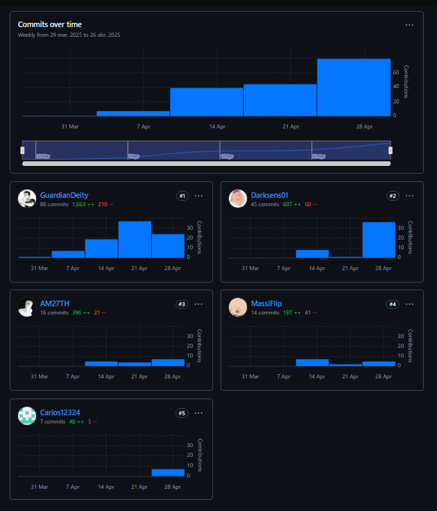
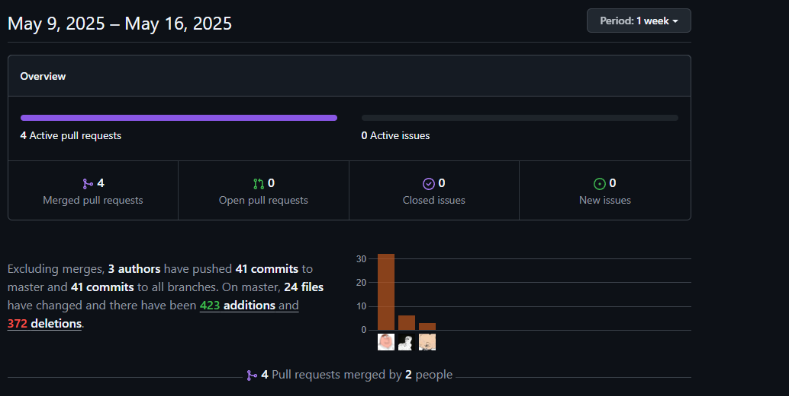

# UNIVERSIDAD PERUANA DE CIENCIAS APLICADAS

---

  

---

# DESARROLLO DE APLICACIONES OPEN SOURCE - 1ASI0729 - 4313

---

## INFORME DEL TRABAJO FINAL

### PROFESOR: Sanchez Seña, Alberto Wilmer
### START UP: GPT4
### PRODUCTO: Moveo

### INTEGRANTES:

<table>
  <thead>
    <tr>
      <th style="background-color: #333; color: #fff;">Apellidos y Nombres</th>
      <th style="background-color: #333; color: #fff;">Código de Alumno</th>
    </tr>
  </thead>
  <tbody>
    <tr>
      <td>Castañeda Guimas, Giancarlo Santiago</td>
      <td>u202310601</td>
    </tr>
    <tr>
      <td>Gonzales Valverde, Carlos Matthew</td>
      <td>u202314130</td>
    </tr>
    <tr>
      <td>Lizano Coll Cardenas, Fernando Jesus</td>
      <td>u202214522</td>
    </tr>
    <tr>
      <td>Nikaido Vargas, Javier Masaru</td>
      <td>u20221g099</td>
    </tr>
    <tr>
      <td>Trillo Hernandez, Anghel Melanie</td>
      <td>u201912401</td>
    </tr>
  </tbody>
</table>

--- 

2025 - 01

---

# Registro de Versiones del Informe

<table>
  <thead>
    <tr>
      <th style="background-color: #333; color: #fff;">Versión</th>
      <th style="background-color: #333; color: #fff;">Fecha</th>
      <th style="background-color: #333; color: #fff;">Autor</th>
      <th style="background-color: #333; color: #fff;">Descripción de modificación</th>
    </tr>
  </thead>
  <tbody>
    <tr>
      <td>1.0</td>
      <td>27/04/25</td>
      <td>Casteñeda, Giancarlo</td>
      <td>Se realizó la primera entrega de manera eficiente, cumpliendo con los objetivos establecidos. Durante el desarrollo se identificaron oportunidades de mejora que serán aplicadas en las siguientes versiones para optimizar los resultados.</td>
    </tr>
    <tr>
      <td>2.0</td>
      <td>13/05/25</td>
      <td>Castañeda, Giancarlo</td>
      <td>Se realizo la entrega parcial de manera eficiente, cumpliendo con los objetivos establecidos y intentando resolver las observaciones del profesor. Durante el desarrollo se identificaron diversas medidas de mejora como ahorro de tiempo y optimización de resultados</td>
    </tr>
    <tr>
      <td>3.0</td>
      <td>15/06/25</td>
      <td>Castañeda, Giancarlo</td>
      <td>Se realizo la segunda entrega de manera eficiente, cumpliento con los objetivos 
      establecidos. Se levanto las respectivas observaciones hechas por el profesor y ademas se
      empezo a plantear como llegariamos para el final del curso.</td>
    </tr>
    <tr>
      <td>4.0</td>
      <td>10/07/25</td>
      <td>Castañeda, Giancarlo</td>
      <td>Implementamos el IAM en nuestro FrontEnd para la implementación de usuarios, registro de usuarios y guardado de token </td>
    </tr>
  </tbody>
</table>

---

# Project Report Collaboration Insights
Para este proyecto hemos utilizado las herramientas GitHub para gestionar el progreso grupal. Además, se puede acceder al contenido del repositorio pulsando sobre el siguiente ícono:

  

## Members of the team on GitHub    

<table>
  <thead>
    <tr>
      <th style="background-color: #333; color: #fff;">Apellidos y Nombres</th>
      <th style="background-color: #333; color: #fff;">Github Account</th>
    </tr>
  </thead>
  <tbody>
    <tr>
      <td>Castañeda Guimas, Giancarlo Santiago</td>
      <td>Darksens01</td>
    </tr>
    <tr>
      <td>Gonzales Valverde, Carlos Matthew</td>
      <td>Carlos12324</td>
    </tr>
    <tr>
      <td>Lizano Coll Cardenas, Fernando Jesus</td>
      <td>GuardianDeity</td>
    </tr>
    <tr>
      <td>Nikaido Vargas, Javier Masaru</td>
      <td>MassiFlip</td>
    </tr>
    <tr>
      <td>Trillo Hernandez, Anghel Melanie</td>
      <td>AM27TH</td>
    </tr>
  </tbody>
</table>

### Entregable TB1

A continuación, se presentan los gráficos de colaboración de los integrantes del equipo en el repositorio de nuestro primer sprint. Estos gráficos ofrecen una representación visual de la cantidad de contribuciones realizadas por cada miembro del equipo, junto con la fecha en que se llevaron a cabo. Además, se presenta información sobre la cantidad de líneas de código que se han modificado en cada uno de los commits.

- **Insights**

  

### Entregable TB2

A continuación, se presentan los gráficos de colaboración de los integrantes del equipo en el repositorio de nuestro primer sprint. Estos gráficos ofrecen una representación visual de la cantidad de contribuciones realizadas por cada miembro del equipo, junto con la fecha en que se llevaron a cabo. Además, se presenta información sobre la cantidad de líneas de código que se han modificado en cada uno de los commits.
- **Insights**

### Entregable TB2

A continuación, se presentan los gráficos de colaboración de los integrantes del equipo en el repositorio de nuestro primer sprint. Estos gráficos ofrecen una representación visual de la cantidad de contribuciones realizadas por cada miembro del equipo, junto con la fecha en que se llevaron a cabo. Además, se presenta información sobre la cantidad de líneas de código que se han modificado en cada uno de los commits.
- **Insights**

  

### Entregable TF

A continuación, se presentan los gráficos de colaboración de los integrantes del equipo en el repositorio de nuestro primer sprint. Estos gráficos ofrecen una representación visual de la cantidad de contribuciones realizadas por cada miembro del equipo, junto con la fecha en que se llevaron a cabo. Además, se presenta información sobre la cantidad de líneas de código que se han modificado en cada uno de los commits.
- **Insights**

  

---
# Contenido
## Tabla de Contenidos
### [Registro de versiones del informe](#registro-de-versiones-del-informe)
### [Project Report Collaboration Insights](#project-report-collaboration-insights)
### [Contenido](#contenido)
### [Student Outcome](#student-outcome-1)

### [Capítulo I: Introducción](/chapter01.md)
- [1.1. Startup Profile](/chapter01.md#11-startup-profile)
    - [1.1.1. Descripción de la Startup](/chapter01.md#111-description-de-la-startup)
    - [1.1.2. Perfiles de integrantes del equipo](/chapter01.md#112-perfiles-de-integrantes-del-equipo)
- [1.2. Solution Profile](/chapter01.md#12-solution-profile)
    - [1.2.1 Antecedentes y problemática](/chapter01.md#121-antecedentes-y-problemática)
    - [1.2.2 Lean UX Process](/chapter01.md#12-solution-profile)
        - [1.2.2.1. Lean UX Problem Statements](/chapter01.md#1221-lean-ux-problem-statements)
        - [1.2.2.2. Lean UX Assumptions](/chapter01.md#1222-lean-ux-assumptions)
        - [1.2.2.3. Lean UX Hypothesis Statements](/chapter01.md#1223-lean-ux-hypothesis-statements)
        - [1.2.2.4. Lean UX Canvas](/chapter01.md#1224-lean-ux-canvas)
- [1.3. Segmentos objetivos](/chapter01.md#13-segmentos-objetivos)

### [Capítulo II: Requirements Elicitation & Analysis](/chapter02.md)
- [2.1. Competidores](/chapter02.md#21-competidores)
    - [2.1.1. Análisis competitivo](/chapter02.md#211-análisis-competitivo)
    - [2.1.2. Estrategias y tácticas frente a competidores](/chapter02.md#212-estrategias-y-tácticas-frente-a-competidores)
- [2.2. Entrevistas](/chapter02.md#22-entrevistas)
    - [2.2.1. Diseño de entrevistas](/chapter02.md#221-diseño-de-entrevistas)
    - [2.2.2. Registro de entrevistas](/chapter02.md#222-registro-de-entrevistas)
    - [2.2.3. Análisis de entrevistas](/chapter02.md#223-análisis-de-entrevistas)
- [2.3. Needfinding](/chapter02.md#23-need-finding)
    - [2.3.1. User Person](/chapter02.md#231-user-person)
    - [2.3.2. User Task Matrix](/chapter02.md#232-user-task-matrix)
    - [2.3.3. User Journey Mapping](/chapter02.md#233-user-journey-mapping)
    - [2.3.4. Empathy Mapping](/chapter02.md#234-empathy-mapping)
    - [2.3.5. As-is Scenario Mapping](/chapter02.md#235-as-is-scenario-mapping)

### [Capítulo III: Requirements Specification](/chapter03.md)
- [3.1. To-Be Scenario Mapping](/chapter03.md#31-to-be-scenario-mapping)
- [3.2. User Stories](/chapter03.md#32-user-stories)
- [3.3. Impact Mapping](/chapter03.md#33-impact-mapping)
- [3.4. Product Backlog](/chapter03.md#34-product-backlog)

### [Capítulo IV: Product Design](/chapter04.md)
- [4.1. Style Guidelines](/chapter04.md#41-style-guidelines)
    - [4.1.1. General Style Guidelines](/chapter04.md#411-general-style-guidelines)
    - [4.1.2. Web Style Guidelines](/chapter04.md#412-web-style-guidelines)
- [4.2. Information Architecture](/chapter04.md#42-information-architecture)
    - [4.2.1. Organization Systems](/chapter04.md#421-organization-systems)
    - [4.2.2. Labeling Systems](/chapter04.md#422-labeling-systems)
    - [4.2.3. SEO Tags and Meta Tags](/chapter04.md#423-seo-tags-and-meta-tags)
    - [4.2.4. Searching Systems](/chapter04.md#424-searching-systems)
    - [4.2.5. Navigation Systems](/chapter04.md#425-navigation-systems)
- [4.3. Landing Page UI Design](/chapter04.md#43-landing-page-ui-design)
    - [4.3.1. Landing Page Wireframe](/chapter04.md#431-landing-page-wireframe)
    - [4.3.2. Landing Page Mock-up](/chapter04.md#432-landing-page-mock-up)
- [4.4. Web Applications UX/UI Design](/chapter04.md#44-web-applications-uxui-design)
    - [4.4.1. Web Applications Wireframes](/chapter04.md#441-web-applications-wireframes)
    - [4.4.2. Web Applications Wireflow Diagrams](/chapter04.md#442-Web-Applications-Wire-flow-Diagrams)
    - [4.4.3. Web Applications Mock-ups](/chapter04.md#443-web-applications-mock-ups)
    - [4.4.4. Web Applications User Flow Diagrams](/chapter04.md#444-web-applications-user-flow-diagrams)
- [4.5. Web Applications Prototyping](/chapter04.md#45-web-applications-prototyping)
- [4.6. Domain-Driven Software Architecture](/chapter04.md#46-domain-driven-software-architecture)
    - [4.6.1. Software Architecture Context Diagram](/chapter04.md#461-software-architecture-context-diagram)
    - [4.6.2. Software Architecture Container Diagrams](/chapter04.md#462-software-architecture-container-diagrams)
    - [4.6.3. Software Architecture Components Diagrams](/chapter04.md#463-software-architecture-components-diagrams)
- [4.7. Software Object-Oriented Design](/chapter04.md#47-software-object-oriented-design)
    - [4.7.1. Class Diagrams](/chapter04.md#471-class-diagrams)
    - [4.7.2. Class Dictionary](/chapter04.md#472-class-dictionary)
- [4.8. Database Design](/chapter04.md#48-database-design)
    - [4.8.1. Database Diagram](/chapter04.md#481-database-diagram)

### [Capítulo V: Product Implementation, Validation & Deployment](/chapter05.md)
- [5.1. Software Configuration Management](/chapter05.md#51-software-configuration-management)
    - [5.1.1. Software Development Environment Configuration](/chapter05.md#511-software-development-environment-configuration)
    - [5.1.2. Source Code Management](/chapter05.md#512-source-code-management)
    - [5.1.3. Source Code Style Guide & Conventions](/chapter05.md#513-source-code-style-guide--conventions)
    - [5.1.4. Software Deployment Configuration](/chapter05.md#514-software-deployment-configuration)
- [5.2. Landing Page, Services & Applications Implementation](/chapter05.md#52-landing-page-services--applications-implementation)
    - [5.2.1. Sprint 1](/chapter05.md#521-sprint-1)
        - [5.2.1.1. Sprint Planning 1](/chapter05.md#5211-sprint-planning-1)
        - [5.2.1.2. Aspect Leaders and Collaborators](/chapter05.md#5212-aspect-leaders-and-collaborators)
        - [5.2.1.3. Sprint Backlog 1](/chapter05.md#5213-sprint-backlog-1)
        - [5.2.1.4. Development Evidence for Sprint Review.](/chapter05.md#5214-development-evidence-for-sprint-review)
        - [5.2.1.5. Execution Evidence for Sprint Review](/chapter05.md#5215-execution-evidence-for-sprint-review)
        - [5.2.1.6. Services Documentation Evidence for Sprint Review](/chapter05.md#5216-services-documentation-evidence-for-sprint-review)
        - [5.2.1.7. Software Deployment Evidence for Sprint Review](/chapter05.md#5217-software-deployment-evidence-for-sprint-review)
        - [5.2.1.8. Team Collaboration Insights during Sprint](/chapter05.md#5218-team-collaboration-insights-during-sprint)
    

### [Conclusiones](/chapter05.md)
- [Conclusiones y recomendaciones](/chapter05.md#conclusiones)
- [Video About the Team](/chapter05.md)

### [Bibliografía](/chapter05.md)
- [Referencias bibliográficas](/chapter05.md#referencias-bibliográficas)

### [Anexos](/chapter05.md)
- [Anexos](/chapter05.md#anexos)

---

# Student Outcome
El curso tiene el Student Outcome 3, el cual consiste en la capacidad de comunicarse efectivamente con un rango de audiencias.

En la siguiente tabla se visualiza cómo las tareas de cada integrante contribuyen al cumplimiento de los aspectos que maneja el Outcome y las conclusiones realizadas de manera grupal.

<table>
  <thead>
    <tr>
      <th style="background-color: #333; color: #fff;">Criterio Específico</th>
      <th style="background-color: #333; color: #fff;">Acciones Realizadas</th>
      <th style="background-color: #333; color: #fff;">Conclusiones</th>
    </tr>
  </thead>
  <tbody>
    <tr>
      <td>Comunica oralmente con efectividad a diferentes rangos de audiencia</td>
      <td>
        <strong>ENTREGABLE TB1:</strong>
          
        <strong>Castañeda, Santiago - TB1:</strong> Durante el desarrollo del proyecto, realice actividades como la descripción de la startup, entrevistar a los segmentos objetivos y hacer sus anilisis, las tablas competitivas y el analisis competitivo, ademas me dedique a realizar diseño Lean UX y UI, el prototipado del proyecto y el resto del capitulo 5 en lo que vendria a ser las evidencias, los insights y las evidencias de la Landing, ademas de las conclusiones, recomendaciones y anexos.
          
        <strong>Castañeda, Santiago - TP1:</strong> Para el desarrollo de esta entrega hice las correciones a partes especificas como las user stories, el product backlog, el C4, el diagrama de clases y su diccionario, ademas de la implementación del sprint 2.    
          
        <strong>Castañeda, Santiago - TB2:</strong> Para el desarrollo de esta entrega hice las respectivas correciones y actualizaciones que vendrian con el sprint 3, como pueden ser el diarama de clases, datos y el modelado C4, y me dedique por completo con el Backend, desplegandolo y configurando todas sus endpoints   
          
        <strong>Castañeda, Santiago - TF:</strong> Durante el desarrollo del Trabajo Final me encargué de liderar el diseño y la implementación del backend del sistema, asegurando la correcta configuración y despliegue de los endpoints necesarios para las funcionalidades clave del proyecto 
          
        <strong>Gonzales, Carlos - TB1:</strong> Durante el desarrollo del proyecto, realice las actividades, como la landing page en el tema de las imagenes, traduccion, me encargue de realizar las entrevistas junto con el analisis de las entrevistas, aplique HTML, CSS y JS en la landing page, tambien realice el searching systems, navigation system, software architecture components diagrams, apoye con mi equipo en las actividades que les faltaban tambien.
          
        <strong>Lizano, Fernando - TB1:</strong> Durante el desarrollo del proyecto, me enfoqué en comunicar de manera clara y efectiva el orden y la estructura del informe en las reuniones grupales. Cada vez que surgieron dudas o propuestas de mejora, expuse de forma precisa los cambios necesarios, adaptando mi comunicación según el perfil de los integrantes del equipo, buscando siempre asegurar que todos comprendieran el objetivo común. Además, fomenté un espacio de retroalimentación constante para que las mejoras en los capítulos fueran comprendidas y aplicadas correctamente.
          
        <strong>Lizano, Fernando - TP1:</strong> Durante el desarrollo del frontend, me aseguré de comunicar con claridad la estructura y lógica visual del proyecto. Expliqué los cambios necesarios según el perfil del equipo y promoví una retroalimentación constante para aplicar mejoras de forma efectiva.
          
        <strong>Lizano, Fernando - TB2:</strong> Durante el desarrollo del backend, me aseguré de comunicar con claridad la estructura del código y la lógica del sistema. Expliqué los cambios necesarios según el perfil del equipo y fomenté una retroalimentación constante para implementar mejoras de forma efectiva.
          
        <strong>Nikaido, Javier - TB1:</strong> Durante el desarrollo de proyectos como el de VeciHub, he demostrado mi capacidad para redactar informes técnicos claros y concisos, adaptados a diferentes audiencias, usando un lenguaje adecuado según el nivel de especialización. Esto lo logré a través de la documentación de cada fase del proceso Lean UX, la matriz de tareas del usuario y el backlog de sprint.
           
        <strong>Nikaido, Javier - TP1: </strong> Creacion de views: car-record, corolla-page, payment-edit, payment-view y record archived.    
          
        <strong>Trillo, Anghel - TB1:</strong> Durante el proyecto Moveo, logré comunicarme oralmente de manera efectiva con diferentes audiencias, adaptando mi mensaje según su nivel de conocimiento. Puedo explicar conceptos técnicos de desarrollo de software como User Persona, User Journey Map, Empathy Map, Product Backlog, Class Diagram, Class Dictionary, Database Diagram y Software Configuration Management. Además, supe cómo presentar estos elementos y su rol en el diseño, planificación y desarrollo de un producto, facilitando la colaboración y comprensión dentro de un equipo multidisciplinario.
           
        <strong>Trillo, Anghel - TP1:</strong> Para el desarrollo de esta entrega hice las correciones de la diferenciación de estrategias y tácticas, mejore la definición de epics y user stories, asi como la priorización en el product backlog, adicional a ello aplique mejoras continuas en la landing page y desarrollo la vista de renta para el app.
          
        <strong>Trillo, Anghel - TB2:</strong> Durante el desarrollo del backend, me encargué de comunicar de manera clara tanto la estructura del código como la lógica del sistema. Adapté las explicaciones a las características del equipo y promoví una retroalimentación continua para aplicar mejoras de manera eficiente.
          
          
        <strong>Trillo, Anghel - TF:</strong> Durante el desarrollo del Trabajo Final me encargué de diseñar el diagrama de base de datos y mejoras del backend donde estabamos presentando inconvenientes por palabras reservadas del SQL, tambien asegurando la correcta configuración y despliegue de los endpoints clave del proyecto.
          
      <td>
         TB1: Al trabajar como equipo en este proyecto, hemos aprendido a comunicarnos de manera más efectiva y a distribuir tareas según las fortalezas de cada miembro. La colaboración constante nos permitió mejorar nuestra organización y gestionar los tiempos de forma eficiente. Además, enfrentamos desafíos técnicos y de coordinación que nos enseñaron a adaptarnos rápidamente y a buscar soluciones conjuntas. Esta experiencia ha reforzado la importancia de la confianza y el apoyo mutuo dentro de un equipo de trabajo, lo cual fue clave para el avance y éxito del proyecto.
           
         TP1: Al trabajar como equipo en este proyecto, hemos aprendido a comunicarnos de manera más efectiva y a distribuir tareas según las fortalezas de cada miembro. La colaboración constante nos permitió mejorar nuestra organización y gestionar los tiempos de forma eficiente. Además, enfrentamos desafíos técnicos y de coordinación que nos enseñaron a adaptarnos rápidamente y a buscar soluciones conjuntas. Esta experiencia ha reforzado la importancia de la confianza y el apoyo mutuo dentro de un equipo de trabajo, lo cual fue clave para el avance y éxito del proyecto.
           
         TB2: En esta entrega nos enfocamos mas en la organización y tomar riesgos, hemos aprendido que la colaboración y distribución de asignaciones según las fortalezas de cada miembro. Cda uno tiene especialidades y se deben aprovechar para estas entregas las cuales se van volviendo mucho mas dificiles cuanto mas las dejamos pasar
          
         TF: Durante el desarrollo del Trabajo Final, reforzamos nuestras capacidades de colaboración, priorización y toma de decisiones bajo presión. Aprendimos a organizarnos mejor frente a tareas complejas, manteniendo una comunicación clara y efectiva para coordinar la integración entre diferentes componentes del sistema.
      </td>
      </tr>
      <tr>
      <td>Comunica por escrito con efectividad a diferentes rangos de audiencia</td>
      <td>
        <strong>ENTREGABLE TB1:</strong>
          
        <strong>Castañeda, Santiago - TB1:</strong> Como equipo, aprendimos a trabajar en ambientes dificultosos y a veces tardados. Despues de lograr resolver algunas dificultades demostramos ser un buen grupo que cuenta con muchas habilidades individual y grupalmente hablando. Nos faltaria lograr una mejor estructuración del tiempo para lograr tener un mejor margen de error
          
        <strong>Castañeda, Santiago - TP1:</strong> Como equipo logramos acabar determinar instacias y tiempos para poder terminar el trabajo mas eficientemente y de manera proactiva 
          
        <strong>Castañeda, Santiago - TB2:</strong> Como grupo logramos la constancia necesaria para terminar nuestros proyectos con tiempo de antelación, de una manera relajada y tranquila  
          
        <strong>Castañeda, Santiago - TF:</strong> Como equipo, en esta etapa final logramos consolidar una dinámica de trabajo eficiente y enfocada. Aprendimos a coordinar nuestras tareas con mayor precisión, aprovechando la experiencia adquirida en entregas anteriores para anticiparnos a posibles obstáculo
          
        <strong>Gonzales, Carlos - TB1:</strong> Como grupo tenemos un buen ambiente y siempre sabemos trabajar bajo a presion, incluso si tenemos dificultades con un compañero sabemos como solucionarlo de inmediato, solo nos faltaria mejorar en el aspecto de tener una mejor estructura del tiempo, pero del resto tenemos buena comunicacion, buen ambiente y sabemos trabajar individualmente cada uno.
          
        <strong>Lizano, Fernando - TB1:</strong> En la elaboración del informe, trabajé en mantener un estilo de redacción claro, ordenado y adecuado para distintos tipos de lectores, asegurando que cada capítulo tuviera coherencia y consistencia. También participé en la elaboración y el apoyo en la creación de la landing page, donde la comunicación escrita debía ser precisa y atractiva para los usuarios. Mi enfoque estuvo en transmitir de manera sencilla pero profesional la información, respetando la estructura formal requerida por el curso y adaptándome a las necesidades de comunicación digital para la web.
          
        <strong>Lizano, Fernando - TB1:</strong> En la elaboración del frontend, trabajé en mantener una estructura visual clara, ordenada y coherente, pensando en distintos tipos de usuarios. También apoyé en la creación de la landing page, donde la comunicación visual debía ser precisa y atractiva. Mi enfoque estuvo en transmitir la información de forma sencilla pero profesional, respetando tanto los lineamientos del curso como las buenas prácticas del diseño web.
          
        <strong>Lizano, Fernando - TB2:</strong> En el backend, mantuve una estructura clara y funcional, asegurando una integración efectiva con el frontend. Me enfoqué en una lógica limpia y profesional, cumpliendo los estándares del curso y las necesidades del proyecto.
          
        <strong>Nikaido, Javier - TB1:</strong> En presentaciones de avance y reuniones con miembros del equipo , he demostrado habilidad para exponer resultados y decisiones, facilitando la comprensión de conceptos técnicos y estratégicos. He utilizado un enfoque directo y estructurado en cada fase del proceso, desde la investigación de usuarios hasta la especificación de requerimientos, asegurando que todos los involucrados pudieran entender y aportar a los objetivos del proyecto.            <strong>Nikaido, Javier - TP1: </strong> Creacion de views: car-record, corolla-page, payment-edit, payment-view y record archived.      
        <strong>Trillo, Anghel - TB1:</strong> Durante el proyecto Moveo, logré comunicarme por escrito de manera efectiva con diferentes audiencias, ajustando mi estilo y nivel de detalle según el público al que me dirigía. Fui capaz de redactar documentos técnicos, informes y presentaciones claras y concisas, explicando de manera efectiva conceptos complejos del desarrollo de software como User Persona, User Journey Map, Empathy Map, Product Backlog, Class Diagram, Class Dictionary, Database Diagram y Software Configuration Management. Mi capacidad para transmitir información por escrito facilitó la comprensión y colaboración dentro del equipo y con las partes interesadas.
          
        <strong>Trillo, Anghel - TP1:</strong> Como equipo logramos planificarnos para poder llevar a cabo el trabajo de manera proactiva.
          
        <strong>Trillo, Anghel - TB2:</strong> En la implementación del backend, mantuve una organización coherente y funcional, garantizando su correcta integración con el frontend. Priorizando una lógica ordenada y profesional, aseguré el cumplimiento de los lineamientos del curso y los objetivos del proyecto.
        br> 
        <strong>Trillo, Anghel - TF:</strong> Me mantuve con una organización coherente y funcional al desarrollar el backend, garantizando su correcta integración con el frontend y aseguré el cumplimiento de los lineamientos del curso y los objetivos del proyecto.
        br> 
      <td>
        TB1: Como equipo, hemos aprendido a trabajar juntos en un ambiente colaborativo y adaptativo. La gestión de tareas fue fundamental para aprovechar al máximo nuestras habilidades individuales, mientras nos asegurábamos de mantener el enfoque común. Aprendimos a valorar la importancia de la comunicación constante y la resolución conjunta de problemas, lo que nos permitió crecer como equipo y mejorar tanto a nivel personal como colectivo. Esta experiencia nos ha mostrado cómo las diferentes perspectivas pueden enriquecer un proyecto, haciéndolo más robusto y exitoso.
          
        TP1: Como equipo, hemos aprendido a trabajar juntos en un ambiente colaborativo y adaptativo. La gestión de tareas fue fundamental para aprovechar al máximo nuestras habilidades individuales, mientras nos asegurábamos de mantener el enfoque común. Aprendimos a valorar la importancia de la comunicación constante y la resolución conjunta de problemas, lo que nos permitió crecer como equipo y mejorar tanto a nivel personal como colectivo. Esta experiencia nos ha mostrado cómo las diferentes perspectivas pueden enriquecer un proyecto, haciéndolo más robusto y exitoso
          
        TB2: Como equipo, logramos trabajar de una manera efectiva y aplicada en todo momento, manteniendo comunicación y facilitandonos la capacidad de interactuar entre nosotros.
        Esto nos permitio tener mejores tiempos de entrega y perfeccionar nuestras habilidades criticas con nosotros mismos
          
        TF: En el Trabajo Final, como equipo consolidamos una forma de trabajo más madura y eficiente, basada en la confianza, la comunicación constante y el compromiso compartido. Supimos adaptarnos a los desafíos técnicos y organizativos con mayor fluidez, lo que nos permitió tomar decisiones más acertadas y distribuir las responsabilidades de forma estratégica.
      </td>
</tr>
</tbody>
</table>
