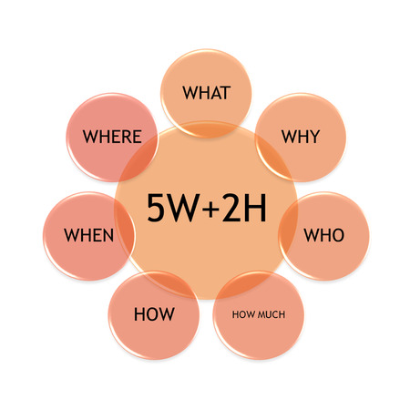
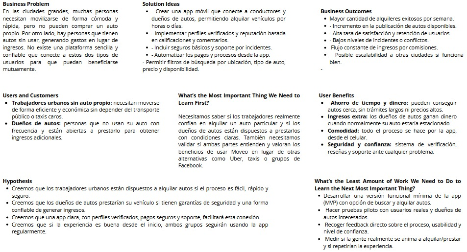

# **CAPÍTULO I: INTRODUCCIÓN**
## 1.1. StartUp Profile
### 1.1.1. Description de la Startup
Nuestra Startup “GPT4” ofrece una aplicación innovadora de préstamos de autos “Moveo” enfocadas a ser un intermediario entre trabajadores que necesiten un auto para movilizarse con facilidad y proveedores los cuales decidan prestar sus autos a cambio de un monto razonable. Ofrecemos una solución independiente al ofrecer los autos como producto principal y contaremos con un modelo de negocio basado en los pagos que se realizarán en la aplicación por el préstamo de los autos. Para ello investigaremos cómo cumplir con esta meta recolectando fuentes sobre modelos de negocios similares y planificamos el diseño y la codificación de nuestra solución.
### 1.1.2. Perfiles de integrantes del equipo

<table>
  <tr>
  <th colspan="2">Castañeda Guimas, Giancarlo Santiago</th>
  </tr>
  <tr>
    <td></td>
    <td>Estudiante de la carrera de ingeniería de software en la Universidad Peruana de Ciencias Aplicadas cursando el 5to ciclo. Me considero una persona activa y que siempre busca terminar las cosas bien y de ser posible rápidamente. También me gusta la responsabilidad y el buen ambiente entre mis compañeros de grupo.</td>
  </tr>

  <tr>
  <th colspan="2">Gonzales Valverde, Carlos Matthew</th>
  </tr>
  <tr>
    <td></td>
    <td> descripción </td>
  </tr>

  <tr>
  <th colspan="2">Lizano Coll Cardenas, Fernando Jesus</th>
  </tr>
  <tr>
    <td></td>
    <td>Me llamo Fernando Jesus Lizano Coll Cardenas. A mis 20 años me considero un apasionado por el mundo de la programación y aprendizaje constante. Actualmente tengo conocimientos en el lenguaje de C++, HTML, CSS, JavaScript y Python. Aunque mis conocimientos son todavía básicos. Me identifico como alguien de pensamiento de superación. Busco crecer en cada aspecto de mi vida y enfrentar desafíos con una actitud positiva y resoluta. Espero poder aportar y motivar a mis compañeros durante la elaboración de este proyecto.</td>
  </tr>

  <tr>
    <th colspan="2">Nikaido Vargas, Javier Masaru</th>
  </tr>
  <tr>
    <td></td>
    <td>Estudiante de Ingenieria de Software de 5to ciclo de la Universidad Peruana de Ciencias Aplicadas. Me gusta hacer las cosas con tiempo y ordenadamente, trabajar con tranquilidad y terminar mis deberes a tiempo.</td>
  </tr>

  <tr>
    <th colspan="2">Trillo Hernandez, Anghel Melanie</th>
  </tr>
  <tr>
    <td></td> 
    <td>Estudiante de la carrera de Ingenieria de Software de la Universidad Peruana de Ciencias Aplicadas (UPC) cursando el 5to ciclo, lo que me gusta de la carrera es desarrollar soluciones innovadoras que contribuyen a la sociedad. Me considero una persona responsable y orientada a resultados. Asimismo, me comprometo a colaborar en el equipo de forma continua y puntual.</td>
  </tr>
</table>

## 1.2. Solution Profile
### 1.2.1. Antecedentes y problemática
Actualmente, muchas personas desean conseguir un medio de transporte propio, ya sea para transportarse libremente o tener que transportarse a lugares específicos como los trabajadores a sus centros de trabajo, lamentablemente para ellos representa un gran reto económico y logístico. Este problema se vuelve más evidente en contextos urbanos donde las distancias laborales son largas y los horarios de transporte público no siempre se adaptan a las necesidades individuales. 
Por otro lado, muchos propietarios de vehículos enfrentan el problema contrario, ya que, sus autos pasan largos periodos sin uso, acumulando costos por mantenimiento, seguros y depreciación, sin generar ningún tipo de retorno económico.

Así mismo, Para analizar los antecedentes y problemáticas del desarrollo nuestro proyecto, estaremos utilizando la técnica de las 5W y 2H (Who, What, When, Where, Why, How, How much). La cual ha sido estructurada de la siguiente manera:

- **Who:** Los principales afectados son trabajadores urbanos y personas sin vehículo propio, quienes requieren un medio de transporte práctico, flexible y económico sin tener que asumir los altos costos de adquirir un auto. Asimismo, también se ven involucrados los propietarios de autos subutilizados, ya que poseen vehículos que permanecen inactivos la mayor parte del tiempo y podrían estar generando ingresos pasivos en lugar de acumular gastos en mantenimiento, seguros e impuestos.  

- **What:** Aquellos que necesitan una alternativa de movilidad accesible enfrentan barreras para acceder a vehículos sin comprarlos o depender de taxis y apps de transporte, que suelen ser costosos o poco eficientes. Al mismo tiempo, muchos dueños de autos se ven perjudicados al no sacar provecho de un recurso valioso que permanece estacionado y genera costos sin retorno.

- **Where:** Esta problemática es especialmente evidente en zonas urbanas densamente pobladas, como Lima, donde el tráfico es caótico, el transporte público suele ser deficiente y las distancias pueden representar un reto para quienes no cuentan con un medio de transporte propio.

- **When:** El problema ocurre de forma recurrente, especialmente durante horas punta, días laborales o épocas de alta demanda como feriados, eventos masivos o temporadas vacacionales, cuando la necesidad de un transporte eficiente se vuelve aún más urgente.  

- **Why:** Comprar un auto representa una inversión elevada que no siempre es rentable para quienes solo lo utilizarían ocasionalmente. Por otro lado, el uso de servicios de taxi o transporte por aplicación puede resultar poco práctico a largo plazo. Al mismo tiempo, tener un vehículo inactivo implica un desperdicio de recursos y espacio, sin aprovechar su potencial económico.  

- **How:** La mayoría de personas que dependen del transporte público lo consideran inseguro, incómodo y poco confiable. Es común ver trabajadores preocupados por llegar tarde debido a la falta de disponibilidad o demoras en el servicio. Por su parte, los propietarios de autos muchas veces no contemplan la opción de alquilar sus vehículos, aunque la posibilidad de obtener ingresos pasivos puede resultarles atractiva si se presenta de manera segura y accesible.  

- **How Much:** El impacto económico varía: para los usuarios frecuentes de transporte, los costos pueden ser elevados, especialmente si requieren desplazamientos largos o diarios. Para los propietarios, se traduce en una pérdida de oportunidades de generar ingresos, además del riesgo de que el vehículo represente un pasivo en lugar de un activo, acumulando gastos por mantenimiento, seguro e impuestos.  

 

  

El problema en sí puede variar de precios, en este caso para los trabajadores puede ser un promedio elevado especialmente si necesitan de movilidad frecuente y por largos trayectos. Para los propietarios de autos en este caso sería una perdida de oportunidades económicas, sus autos podrían generar gastos a futuro como mantenimiento y seguro.

### 1.2.2. Lean UX Process

#### 1.2.2.1. Lean UX Problem Statements

**Usuario objetivo:**

Trabajadores que necesitan moverse con libertad, pero que no tienen auto, y personas que tienen autos que casi no usan y quieren ganar algo extra con ellos.

**Qué necesitan:**

- Los trabajadores buscan una forma fácil y económica de tener un auto por un tiempo sin tener que comprarlo.
- Los dueños de autos quieren prestarlo, pero de forma segura y sin tantas complicaciones.

**Problemas que tienen:**

- No hay muchas plataformas que conecten a ambas partes sin cobrar mucho o pedir mil requisitos.
- A veces hay desconfianza en prestar un auto a alguien desconocido o en subirse a un auto ajeno.

**Nuestra propuesta:**

Una app llamada **Moveo** que sirva de intermediario. Los trabajadores pueden buscar un auto cerca, y los dueños lo pueden ofrecer con seguridad. Todo el proceso sería por la app: verificación, pagos, soporte, etc.

---

#### 1.2.2.2. Lean UX Assumptions

**Supuestos de negocio:**

1. Creemos que los usuarios quieren alquilar autos sin tantas vueltas, sin ir a una agencia.
2. Pensamos que con una app donde todo esté claro (precios, disponibilidad, contacto) se animarían más.
3. Los primeros que usarán la app serían trabajadores que se movilizan a diario y dueños de autos que no usan mucho su carro.
4. El valor que más les importa es sentirse seguros y que el servicio sea práctico.
5. También valoran el hecho de que puedan resolver todo desde su celular, sin salir de casa.
6. Vamos a llegar a los usuarios por redes, referidos, promociones y quizás convenios con empresas.
7. La app ganaría por comisión en cada alquiler o planes premium para dueños frecuentes.
8. Nuestra competencia serían agencias de alquiler, Uber o incluso grupos de Facebook para alquilar carros.
9. Nuestra ventaja es que somos más accesibles, rápidos y enfocados en trayectos diarios o alquileres cortos.
10. Un riesgo es que la gente tenga miedo de prestar su carro.
11. Planeamos resolver eso con seguros, perfiles verificados y un sistema de reputación.

**Supuestos de usuario:**

- **¿Quiénes son?** Trabajadores sin auto propio y dueños de autos que no usan mucho.
- **¿Qué queremos resolver?** Que los primeros puedan movilizarse mejor y los segundos ganen dinero con sus autos.
- **¿Qué buscan en la app?** Que sea clara, que no se complique, y que se sientan protegidos.
- **¿Dónde encaja en su vida?** Para el trabajador, es una forma de llegar al trabajo o moverse sin depender de buses o taxis caros. Para el dueño del auto, es una forma pasiva de tener ingresos extra.
- **¿Cuándo y cómo usan la app?** Cuando necesitan moverse o cuando su carro esté libre. Desde el celular, viendo autos cercanos o viendo si alguien quiere usar su auto.
- **¿Cómo debe verse la app?** Bonita, simple, con botones grandes. Que no te pierdas buscando funciones, y que puedas hacer todo en pocos pasos.

---

#### 1.2.2.3. Lean UX Hypothesis Statements

- **Hipótesis 1:**
  - Creemos que los trabajadores quieren alquilar un auto sin pagar tanto ni complicarse.
  - Cuando entren a la app, van a buscar un auto cerca para unas horas o todo el día.
  - Entonces podrán reservarlo desde la app, pagar y usarlo.
  - Sabremos que funcionó si repiten el uso varias veces en una semana.

- **Hipótesis 2:**
  - Creemos que los dueños de autos quieren una forma de ganar dinero sin estrés.
  - Cuando suban su auto a Moveo, pondrán su horario y condiciones.
  - Entonces alguien lo reservará y ellos solo tendrán que entregarlo (o no, si se hace con recojo automático).
  - Sabremos que está funcionando si hay más autos publicados y los dueños están contentos con sus ganancias.

- **Hipótesis 3:**
  - Creemos que los usuarios quieren saber que están protegidos si pasa algo malo.
  - Cuando ocurra un problema, podrán reportarlo por la app.
  - Entonces activamos soporte o el seguro según el caso.
  - Sabremos que la experiencia es buena si los problemas se resuelven rápido y sin peleas.

---

#### 1.2.2.4. Lean UX Canvas

El Lean UX Canvas nos ayudó a organizar nuestras ideas sobre cómo ayudar a nuestros usuarios y validar si el proyecto tiene futuro. Estas son algunas partes clave:

    

## 1.3. Segmentos Objetivos
#### Segmento objetivo 1: Trabajadores Urbanos  
**Descripción:**  
Son personas económicamente estables las cuales, por las características de su trabajo o lugar de residencia, requieren de un medio de transporte flexible y autónomo sin necesidad de adquirir un vehículo propio.

**Características demográficas:**  
* Edad: 25 a 55 años.  
* Estado Laboral: Empleados a tiempo completo, trabajadores FreeLancer, profesionales.
* Perfil económico: Clase media-alta
* Ubicación: Áreas urbanas o suburbanas, especialmente en ciudades con transporte público saturado

#### Segmento objetivo 2: Proveedores de autos  
**Descripción:**   
Dueños de vehículos particulares que no utilizan sus autos de manera constante y desean generar ingresos adicionales poniéndolos en alquiler mediante una plataforma segura y automatizada.

**Características demográficas:** 
* Edad: 28 a 65 años.  
* Perfil económico: clase media y media-alta
* Ubicación: zonas urbanas y residenciales donde es común tener vehículos adicionales (familias con varios autos o personas que trabajan desde casa y no utilizan su vehículo a diario).
