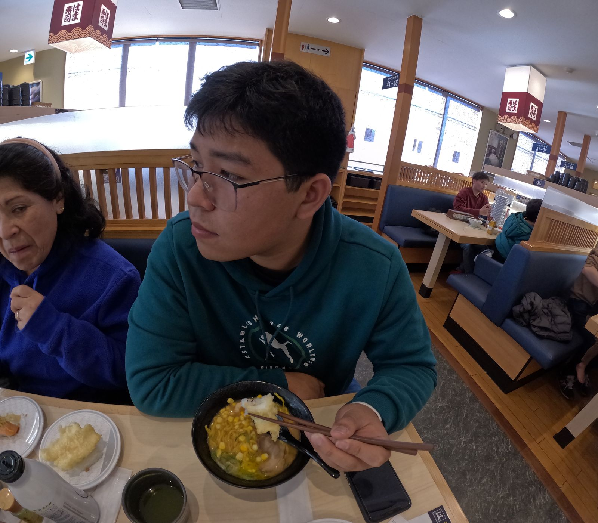

# **CAPÍTULO I: INTRODUCCIÓN**
## 1.1. StartUp Profile
### 1.1.1. Description de la Startup
Nuestra Startup “GPT4” ofrece una aplicación innovadora de préstamos de autos “Moveo” enfocadas a ser un intermediario entre trabajadores que necesiten un auto para movilizarse con facilidad y proveedores los cuales decidan prestar sus autos a cambio de un monto razonable. Ofrecemos una solución independiente al ofrecer los autos como producto principal y contaremos con un modelo de negocio basado en los pagos que se realizarán en la aplicación por el préstamo de los autos. Para ello investigaremos cómo cumplir con esta meta recolectando fuentes sobre modelos de negocios similares y planificamos el diseño y la codificación de nuestra solución.
### 1.1.2. Perfiles de integrantes del equipo

| Foto                                 | Alumno            | Descripción                                                                                                                                                                                                                                                                                                                                                                  |
| ------------------------------------ | ----------------- | ---------------------------------------------------------------------------------------------------------------------------------------------------------------------------------------------------------------------------------------------------------------------------------------------------------------------------------------------------------------------------- |
|         Foto aqui                             |       **Giancarlo Santiago Castañeda Guimas**               |                 Estudiante de la carrera de ingeniería de software en la Universidad Peruana de Ciencias Aplicadas cursando el 5to ciclo. Me considero una persona activa y que siempre busca terminar las cosas bien y de ser posible rápidamente. También me gusta la responsabilidad y el buen ambiente entre mis compañeros de grupo.
|                                  |       Javier Masaru Nikaido Vargas               |                 Estudiante de Ingenieria de Software de 5to ciclo de la Universidad Peruana de Ciencias. Me gusta hacer las cosas con tiempo y ordenadamente, trabajar con tranquilidad y terminar mis deberes a tiempo.                                                                                                     |         Foto aqui                             |       Nombre aqui               |                 Descripción tuya aqui                                                                                                     |         Foto aqui                             |       Nombre aqui               |                 Descripción tuya aqui                                                                                                                                                                                                                                                                                                 

## 1.2. Solution Profile
### 1.2.1. Antecedentes y problemática
Actualmente muchas personas desean conseguir un medio de transporte propio, ya sea para transportarse libremente o tener que transportarse a lugares específicos como los trabajadores a sus centros de trabajo, lamentablemente para ellos representa un gran reto económico y logístico. Este problema se vuelve más evidente en contextos urbanos donde las distancias laborales son largas y los horarios de transporte público no siempre se adaptan a las necesidades individuales. 
Por otro lado, muchos propietarios de vehículos enfrentan el problema contrario, ya que, sus autos pasan largos periodos sin uso, acumulando costos por mantenimiento, seguros y depreciación, sin generar ningún tipo de retorno económico.
#### 5W&2H
**What**

Las personas que necesitan una movilidad flexible y asequible se enfrentan a barreras para acceder a vehículos sin tener que comprar uno o depender de taxis o apps de transporte, lo que resulta costoso o poco eficiente.
Por otro lado, muchos propietarios de autos tienen vehículos que permanecen estacionados gran parte del tiempo, generando gastos en lugar de ingresos.

**Why**

Actualmente comprar un auto es una inversión alta y no siempre rentable si solo se necesita esporadicamente, ademas utilizar otras alternativas como Uber o taxis no siempre resultará económico o eficientes.
Por el lado contrario, las personas que no utilizan sus autos representa un desperdicio de recursos y espacio en el garaje.

**Who**

Los afectados que identificamos son en su mayoría trabajadores urbanos o básicamente personas sin auto propio ya que necesitan un medio de transporte práctico y económico pero no desean asumir los gastos de un auto propio y además los propietarios de autos sin utilizar ya que tienen vehículos que solo usan ocasionalmente y podrían generarse ingresos pasivos en vez de acumular gastos de mantenimiento, seguros e impuestos

**When**

Usualmente este problema ocurre a diario, especialmente en horas punta o cuando el transporte público es ineficiente, en temporadas de alta demanda como eventos, feriados, etc.  

**Where**

El problema se hace más visible en ciudades urbanas, como Lima, donde la movilidad es un caos y ir en transporte público a veces puede ser una pesadilla.

**How**

En su mayoría los trabajadores que dependen del transporte público lo encuentran poco seguro, incómodo o en su mayoría encuentran una sensación de incomodidad. Día a día se ven a trabajadores yendo con la preocupación de llegar tarde a su trabajo debido a no encontrar un transporte público a tiempo.  
Por otro lado los propietarios de autos que no le dan utilidad no suelen pensar en la idea de rentar sus vehículos a terceros, pero siempre esta la oportunidad de generar un ingreso pasivo lo cual podrá sonar atractivo para ellos

**How Much**

El problema en sí puede variar de precios, en este caso para los trabajadores puede ser un promedio elevado especialmente si necesitan de movilidad frecuente y por largos trayectos.  
Para los propietarios de autos en este caso sería una perdida de oportunidades económicas, sus autos podrían generar gastos a futuro como mantenimiento y seguro.
### 1.2.2. Lean UX Process

#### 1.2.2.1. Lean UX Problem Statements

**Usuario objetivo:**

Trabajadores que necesitan moverse con libertad, pero que no tienen auto, y personas que tienen autos que casi no usan y quieren ganar algo extra con ellos.

**Qué necesitan:**

- Los trabajadores buscan una forma fácil y económica de tener un auto por un tiempo sin tener que comprarlo.
- Los dueños de autos quieren prestarlo, pero de forma segura y sin tantas complicaciones.

**Problemas que tienen:**

- No hay muchas plataformas que conecten a ambas partes sin cobrar mucho o pedir mil requisitos.
- A veces hay desconfianza en prestar un auto a alguien desconocido o en subirse a un auto ajeno.

**Nuestra propuesta:**

Una app llamada **Moveo** que sirva de intermediario. Los trabajadores pueden buscar un auto cerca, y los dueños lo pueden ofrecer con seguridad. Todo el proceso sería por la app: verificación, pagos, soporte, etc.

---

#### 1.2.2.2. Lean UX Assumptions

**Supuestos de negocio:**

1. Creemos que los usuarios quieren alquilar autos sin tantas vueltas, sin ir a una agencia.
2. Pensamos que con una app donde todo esté claro (precios, disponibilidad, contacto) se animarían más.
3. Los primeros que usarán la app serían trabajadores que se movilizan a diario y dueños de autos que no usan mucho su carro.
4. El valor que más les importa es sentirse seguros y que el servicio sea práctico.
5. También valoran el hecho de que puedan resolver todo desde su celular, sin salir de casa.
6. Vamos a llegar a los usuarios por redes, referidos, promociones y quizás convenios con empresas.
7. La app ganaría por comisión en cada alquiler o planes premium para dueños frecuentes.
8. Nuestra competencia serían agencias de alquiler, Uber o incluso grupos de Facebook para alquilar carros.
9. Nuestra ventaja es que somos más accesibles, rápidos y enfocados en trayectos diarios o alquileres cortos.
10. Un riesgo es que la gente tenga miedo de prestar su carro.
11. Planeamos resolver eso con seguros, perfiles verificados y un sistema de reputación.

**Supuestos de usuario:**

- **¿Quiénes son?** Trabajadores sin auto propio y dueños de autos que no usan mucho.
- **¿Qué queremos resolver?** Que los primeros puedan movilizarse mejor y los segundos ganen dinero con sus autos.
- **¿Qué buscan en la app?** Que sea clara, que no se complique, y que se sientan protegidos.
- **¿Dónde encaja en su vida?** Para el trabajador, es una forma de llegar al trabajo o moverse sin depender de buses o taxis caros. Para el dueño del auto, es una forma pasiva de tener ingresos extra.
- **¿Cuándo y cómo usan la app?** Cuando necesitan moverse o cuando su carro esté libre. Desde el celular, viendo autos cercanos o viendo si alguien quiere usar su auto.
- **¿Cómo debe verse la app?** Bonita, simple, con botones grandes. Que no te pierdas buscando funciones, y que puedas hacer todo en pocos pasos.

---

#### 1.2.2.3. Lean UX Hypothesis Statements

- **Hipótesis 1:**
  - Creemos que los trabajadores quieren alquilar un auto sin pagar tanto ni complicarse.
  - Cuando entren a la app, van a buscar un auto cerca para unas horas o todo el día.
  - Entonces podrán reservarlo desde la app, pagar y usarlo.
  - Sabremos que funcionó si repiten el uso varias veces en una semana.

- **Hipótesis 2:**
  - Creemos que los dueños de autos quieren una forma de ganar dinero sin estrés.
  - Cuando suban su auto a Moveo, pondrán su horario y condiciones.
  - Entonces alguien lo reservará y ellos solo tendrán que entregarlo (o no, si se hace con recojo automático).
  - Sabremos que está funcionando si hay más autos publicados y los dueños están contentos con sus ganancias.

- **Hipótesis 3:**
  - Creemos que los usuarios quieren saber que están protegidos si pasa algo malo.
  - Cuando ocurra un problema, podrán reportarlo por la app.
  - Entonces activamos soporte o el seguro según el caso.
  - Sabremos que la experiencia es buena si los problemas se resuelven rápido y sin peleas.

---

#### 1.2.2.4. Lean UX Canvas

El Lean UX Canvas nos ayudó a organizar nuestras ideas sobre cómo ayudar a nuestros usuarios y validar si el proyecto tiene futuro. Estas son algunas partes clave:

1. **Usuarios:** Trabajadores urbanos y dueños de autos.
2. **Problemas:** No tienen cómo moverse bien / tienen autos sin usar.
3. **Solución:** Una app para conectar a ambos, de forma segura.
4. **Resultado esperado:** Más gente movilizándose y ganando plata con sus carros.
5. **Supuestos:** Que hay interés en alquilar y prestar, pero falta confianza.
6. **Métricas:** Reservas diarias, repeticiones, cantidad de autos publicados.
7. **Estrategia de difusión:** Redes, TikTok, alianzas con empresas o negocios locales.

## 1.3. Segmentos Objetivos
#### Segmento objetivo 1: Trabajadores Urbanos  
**Descripción:**  
Son personas económicamente estables las cuales, por las características de su trabajo o lugar de residencia, requieren de un medio de transporte flexible y autónomo sin necesidad de adquirir un vehículo propio.

**Características demográficas:**  
* Edad: 25 a 55 años.  
* Estado Laboral: Empleados a tiempo completo, trabajadores FreeLancer, profesionales.
* Perfil económico: Clase media-alta
* Ubicación: Áreas urbanas o suburbanas, especialmente en ciudades con transporte público saturado

#### Segmento objetivo 2: Proveedores de autos  
**Descripción:**   
Dueños de vehículos particulares que no utilizan sus autos de manera constante y desean generar ingresos adicionales poniéndolos en alquiler mediante una plataforma segura y automatizada.

**Características demográficas:** 
* Edad: 28 a 65 años.  
* Perfil económico: clase media y media-alta
* Ubicación: zonas urbanas y residenciales donde es común tener vehículos adicionales (familias con varios autos o personas que trabajan desde casa y no utilizan su vehículo a diario).
