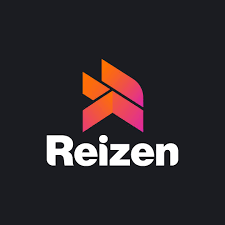

# Capítulo II: Requirements Elicitation & Analysis
## 2.1. Competidores
Para esta sección analizaremos y compararemos a diversos competidores que pudimos llegar a encontrar para así transferir conocimiento detectando las mejores opciones y prácticas que aplicar para nuestra aplicación.

-   Los competidores se pueden dividir en varios tipos, como los que hacen exactamente lo mismo que nosotros, los que no hacen lo mismo pero pueden llegar a solucionarlo, los de mayor rango que serían los que consideramos que estamos muy lejos de alcanzarlos, etc.

En este caso solo nos quedaremos con 3 que pensamos que serían los más óptimos observar:

-   **Plataforma Web “Reizen”**

  

Reizen es una plataforma de movilidad para alquiler de autos, yates y propiedades en LATAM, promoviendo la confianza entre usuarios mediante la cercanía geográfica.</td>

    
-   **Plataforma Web “SnappCar”**

  

SnappCar es una plataforma de alquiler de autos privados que se enfoca en la apertura remota de vehículos y seguro integrado, principalmente en Europa.</td>

    
-   **Aplicación “InDrive”**

  

InDrive es una app de transporte bajo el modelo C2C donde los pasajeros y conductores negocian el precio directamente.</td>

### 2.1.1. Análisis Competitivo

A continuación realizaremos el análisis necesario para ver qué estrategias podemos tomar para sobresalir entre ellos

<table>
  <tr>
    <th colspan="22">Competitive Analysis Landscape</th>
  </tr>
  <tr>
    <td colspan="1">¿Por qué llevar a cabo el análisis?</td>
    <td colspan="17">El análisis competitivo es esencial para entender el mercado, identificar oportunidades de diferenciación y anticipar amenazas. Permite ajustar la estrategia para ganar ventaja sobre la competencia y asegurar el éxito del producto.</td>
  </tr>
  <tr>
    <td colspan="2"></td>
    <td>Moveo </td>
    <td>Reizen </td>
    <td>SnappCar </td>
    <td>InDrive </td>
  </tr>
  <tr>
    <td rowspan="2">Perfil</td>
    <td>Overview</td>
    <td>Moveo es una plataforma open-source que conecta a trabajadores que necesitan un auto por un tiempo y propietarios que desean alquilarlo de forma segura, todo sin intermediarios humanos.</td>
    <td>Reizen es una plataforma de movilidad para alquiler de autos, yates y propiedades en LATAM, promoviendo la confianza entre usuarios mediante la cercanía geográfica.</td>
    <td>SnappCar es una plataforma de alquiler de autos privados que se enfoca en la apertura remota de vehículos y seguro integrado, principalmente en Europa.</td>
    <td>InDrive es una app de transporte bajo el modelo C2C donde los pasajeros y conductores negocian el precio directamente.</td>
  </tr>
  <tr>
    <td>Ventaja competitiva ¿Qué valor ofrece a los clientes?</td>
    <td>Flexibilidad al ser open-source, adaptación a mercados locales, sin intermediarios, integración directa de pagos y verificación dentro de la app.</td>
    <td>Confianza social, comunidad local consolidada y precios flexibles basados en la cercanía de los usuarios.</td>
    <td>Uso de tecnología avanzada, apertura remota de vehículos, seguro integrado y fuerte presencia en Europa.</td>
    <td>Precios negociados directamente por los usuarios y crecimiento exponencial en LATAM, bajo costo de comisión.</td>
  </tr>
  <tr>
    <td rowspan="2">Perfil de Marketing</td>
    <td>Mercado Objetivo</td>
    <td>Trabajadores urbanos y dueños de autos subutilizados en LATAM que buscan soluciones de movilidad flexibles y seguras.</td>
    <td>Usuarios interesados en movilidad ocasional y propietarios de autos que buscan generar ingresos extra en Colombia.</td>
    <td>Usuarios europeos en ciudades con alta cultura de carsharing, que buscan soluciones tecnológicas avanzadas para alquiler de autos.</td>
    <td>Usuarios que buscan transporte flexible en LATAM y otras regiones emergentes donde las tarifas son negociadas entre las partes.</td>
  </tr>
  <tr>
    <td>Estrategias de Marketing</td>
    <td>Crecimiento orgánico a través de la comunidad Open Source, asociaciones con estacionamientos y empresas locales.</td>
    <td>Publicidad en redes sociales locales, y generación de confianza mediante testimonios de usuarios.</td>
    <td>Marketing digital y asociaciones con aseguradoras locales para atraer nuevos usuarios y expandir la base de clientes.</td>
    <td>Modelo viral de boca a boca, con un fuerte crecimiento por recomendación, marketing en aplicaciones móviles.</td>
  </tr>
  <tr>
    <td rowspan="3">Perfil de Producto</td>
    <td>Productos y Servicios</td>
    <td>Alquiler de autos peer-to-peer, apertura remota de vehículos, verificación dentro de la app, pago seguro y elección de puntos de entrega.</td>
    <td>Alquiler peer-to-peer de autos, yates y propiedades en LATAM, con opciones de precios flexibles y seguros incluidos.</td>
    <td>Alquiler peer-to-peer de autos privados, con tecnología avanzada como la apertura remota y seguro integrado.</td>
    <td>Transporte urbano bajo el modelo C2C, donde los precios son negociados en tiempo real entre usuarios y conductores.</td>
  </tr>
  <tr>
    <td>Precios y Costos</td>
    <td>25-40 USD/día promedio dependiendo del modelo y la zona.</td>
    <td>20-45 USD/día, dependiendo del vehículo y la ciudad.</td>
    <td>30-60 USD/día más seguro obligatorio.</td>
    <td>Tarifas por trayecto negociadas entre pasajeros y conductores, con un promedio de 2-7 USD en LATAM.</td>
  </tr>
  <tr>
    <td>Canales de distribución (Web y/o Móvil)</td>
    <td>App móvil y sitio web.</td>
    <td>App móvil y sitio web.</td>
    <td>App móvil y sitio web.</td>
    <td>App móvil (Android/iOS) y crecimiento viral a través de referidos.</td>
  </tr>
  <tr>
    <td rowspan="4">Análisis SWOT</td>
    <td>Fortalezas</td>
    <td>Modelo open-source que permite adaptabilidad, sin intermediarios, flexibilidad para usuarios y proveedores.</td>
    <td>Comunidad local consolidada, confianza y cercanía geográfica entre usuarios.</td>
    <td>Innovación tecnológica con apertura remota, seguro integrado y expansión sólida en Europa.</td>
    <td>Red de usuarios global, crecimiento orgánico, precios negociados entre usuarios, bajas comisiones.</td>
  </tr>
  <tr>
    <td>Debilidades</td>
    <td>Dependencia de una masa crítica de usuarios y autos; mayor esfuerzo de crecimiento en etapas iniciales.</td>
    <td>Limitado a Colombia; posible dificultad de expansión a otros mercados.</td>
    <td>Enfoque en Europa, alta barrera de entrada en otros mercados fuera de la región.</td>
    <td>Enfoque exclusivo en transporte urbano, sin ofrecer alquiler de autos; competencia con apps como Uber y Lyft.</td>
  </tr>
  <tr>
    <td>Oportunidades</td>
    <td>Expansión a otras ciudades emergentes, asociaciones con estacionamientos y empresas de transporte.</td>
    <td>Expansión a otros países, diversificación en más tipos de movilidad (yates y alojamiento).</td>
    <td>Expansión a más continentes, integración con smart city y plataformas de movilidad.</td>
    <td>Ampliar servicios a carsharing o alquiler de autos autónomos.</td>
  </tr>
  <tr>
    <td>Amenazas</td>
    <td>Alta competencia en LATAM y cambios regulatorios que podrían afectar el modelo de negocio.</td>
    <td>Nuevas plataformas y modelos Open Source que replican el concepto de Moveo.</td>
    <td>Competencia local y plataformas internacionales como Uber y Lyft.</td>
    <td>Competencia de plataformas dominantes y regulación cambiante en el transporte urbano.</td>
  </tr>
</table>

### 2.1.2. Estrategias y tácticas frente a competidores

#### Estrategias Clave

##### 1. Diferenciación a través de seguridad y facilidad de uso
- Posicionamiento como plataforma confiable e imparcial (no somos una empresa de transporte ni de alquiler tradicional).
- Verificación digital y automatizada de usuarios y vehículos.
- Cobertura de seguros y asistencia como valor diferencial frente a redes informales o apps tradicionales.

> **Promesa clara**: *"Muévete libremente o gana dinero con tu auto, sin complicaciones ni riesgos."*

##### 2. Alianzas estratégicas
- Convenios con estaciones de servicio, aseguradoras y talleres para ofrecer beneficios a los usuarios Moveo.
- Integración con apps de movilidad o mapas urbanos para mayor visibilidad.

##### 3. Educación del cliente sobre riesgos y beneficios
- Contenido educativo multiformato (videos, reels, blogs, mini guías):
  - Riesgos de alquilar o pedir autos por canales informales.
  - Cómo protegerse y maximizar beneficios con Moveo.
- Historias reales de éxito y recomendaciones prácticas.

##### 4. Segmentación clara del mercado

**Mensajes adaptados para:**
- **Trabajadores urbanos**: “Muévete con independencia, sin tener que comprar un auto.”
- **Proveedores de autos**: “Haz que tu auto trabaje por ti mientras no lo usas.”

#### Tácticas Implementadas

##### 1. Promociones para usuarios tempranos
- Primer alquiler gratuito o con 50% de descuento.
- Bonos de bienvenida para quienes registren su auto.
- Vales de gasolina por primera transacción exitosa.

##### 2. Sistema de reputación visual e incentivos
- Sistema de puntuación pública para arrendatarios y propietarios.
- Insignias o sellos de confianza Moveo visibles en los perfiles destacados.
- Recompensas por buena reputación (descuentos, prioridad en resultados).

##### 3. Campañas en redes sociales geolocalizadas
- Publicidad segmentada en Facebook, Instagram y TikTok.
- Enfoque en zonas urbanas con alto tráfico y baja eficiencia de transporte público (ej. San Isidro, Surco, Magdalena, La Molina).
- Audiencias:
  - Personas que buscan transporte diario económico.
  - Propietarios de autos subutilizados (familias, adultos mayores, trabajadores remotos).

##### 4. Programa de referidos
- Recompensas para quien refiere y para el nuevo usuario.
- Créditos de alquiler o comisiones por cada transacción generada.
- Escalamiento del sistema: embajadores Moveo.

##### 5. Suscripciones para propietarios frecuentes
- Planes mensuales/anuales para dueños de flotas pequeñas.
- Beneficios:
  - Prioridad en búsquedas dentro de la app.
  - Reportes de ingresos mensuales.
  - Diagnósticos preventivos y asistencia técnica express.

##### 6. Funcionalidades clave de la plataforma
- Reserva instantánea y contratos digitales automáticos.
- Panel web y móvil para gestionar alquileres e ingresos.
- Descarga de recibos e informes en PDF.

## 2.2. Entrevistas
### 2.2.1. Diseño de entrevistas
Para las preguntas decidimos antes de todo explicar de qué va nuestro tema, las entrevistas contarán con un tiempo de entre 10 a 15 minutos o la disposición del entrevistado el cual puede cancelar la entrevista en cualquier momento lo desee.

**Para segmento objetivo trabajadores urbanos**

1. Cuéntame cómo es tu rutina diaria cuando necesitas trasladarte de un lugar a otro. ¿Qué medios usas?

2. ¿En qué medio de transportes vas usualmente?

3. ¿En qué situaciones sientes que el transporte que usas no es suficiente o no cumple tus necesidades?

4. ¿Qué factores consideras antes de elegir cómo moverte a tu destino? (Ej. tiempo, costo, comodidad)

5. ¿Qué tan importante es para ti tener autonomía y flexibilidad en tus traslados diarios?

6. ¿Has tenido que pedir prestado un vehículo a amigos o familiares? Cuéntame cómo fue esa experiencia.

7. Cuando tu transporte habitual no está disponible, ¿cómo sueles resolverlo?

8. ¿Cómo te sientes cuando dependes de transporte público o de terceros para llegar a tiempo?

9. Imagina que tienes acceso a un vehículo solo cuando lo necesitas, ¿cómo crees que cambiaría tu día a día?

10. ¿Qué aspectos te harían confiar en una nueva solución de movilidad que te dé más independencia?

**Para segmento objetivo proveedor de autos**

1. En tu día a día, ¿con qué frecuencia utilizas tu auto? ¿Sientes que pasa mucho tiempo estacionado?

2. ¿Qué significa para ti tener un auto? ¿Lo ves más como una inversión, una herramienta o un metodo para tener más libertad?

3. Si tu auto pudiera generarte ingresos cuando no lo usas, ¿qué pensarías de esa posibilidad?

4. ¿Qué condiciones te harían sentir seguro al permitir que otras personas usen tu auto temporalmente?

5. ¿Alguna vez has pensado en formas de obtener ganancias adicionales a partir de las cosas que ya posees? ¿Cómo te ha ido?

6. ¿Conoces a alguien que haya logrado sacarle provecho a su auto aparte de la movilización? (Ejm. Uber, InDrive o rentandolo mismamente)

7. En otros países es común que las personas renten sus autos de forma flexible. ¿Te imaginas que eso pueda funcionar aquí?

8. ¿Qué sentirías si, en lugar de tener tu auto estacionado, pudiera ayudarte a cubrir parte de tus gastos mensuales?

9. ¿Qué características crees que debería tener una plataforma para que sientas que tu auto está protegido cuando lo usa otra persona?

10. ¿Cómo te sentirías al formar parte de una red donde los autos que no están siendo utilizados se ponen a disposición de personas que los necesitan?

### 2.2.2. Registro de entrevistas
| Segmento Objetivo | Trabajador Urbano |
| ----- | ----- |
| **Número de registro** | **Datos del entrevistado** |
| 01 | **Nombre:** Juan Diego  **Edad:** 19  **Profesión:** Estudiante Universitario **Distrito:** Santiago de Surco  **Inicio \- Duración:** 0:00 \- 5:02  **Enlace de la entrevista: [upc-pre-202510-1asi0730-4374-GPT4-needfinding-sprint-1.mp4](https://upcedupe-my.sharepoint.com/personal/u202310601_upc_edu_pe/_layouts/15/stream.aspx?id=%2Fpersonal%2Fu202310601%5Fupc%5Fedu%5Fpe%2FDocuments%2FMoveo%20entrevista%202%20%28Trabajador%29%2Emp4&nav=eyJyZWZlcnJhbEluZm8iOnsicmVmZXJyYWxBcHAiOiJTdHJlYW1XZWJBcHAiLCJyZWZlcnJhbFZpZXciOiJTaGFyZURpYWxvZy1MaW5rIiwicmVmZXJyYWxBcHBQbGF0Zm9ybSI6IldlYiIsInJlZmVycmFsTW9kZSI6InZpZXcifX0&ga=1&referrer=StreamWebApp%2EWeb&referrerScenario=AddressBarCopied%2Eview%2E58a1182c%2D9ba7%2D40ae%2D937b%2Dddd720ff42e0)** |
|  | **Resumen:** Juan Diego no posee auto propio y depende del transporte público para sus desplazamientos diarios, lo que considera una experiencia tediosa e insegura debido al tráfico, la informalidad y las rutas ineficientes. Valora altamente la autonomía y la flexibilidad que otorga conducir un vehículo propio, ya que permite controlar los tiempos de traslado. Ha tenido experiencias positivas alquilando autos en su familia y resalta su preferencia por no depender de terceros para movilizarse. Considera que una aplicación como Moveo podría cambiar su rutina, especialmente en situaciones de urgencia. Sin embargo, recalca que confiaría más en la plataforma si los autos ofrecidos cumplen con requisitos de seguridad como tener documentos en regla (SOAT, revisión técnica) y verificaciones legales.  |
| 02 | **Nombre:** Sebastian Hernandez  **Edad:** 20  **Profesión:** Estudiante y desarrollador de aplicaciones  **Distrito:** San Juan de Lurigancho  **Inicio \- Duración:** 0:00 \- 3:12  **Enlace de la entrevista: [upc-pre-202510-1asi0730-4374-GPT4-needfinding-sprint-2.mp4](https://upcedupe-my.sharepoint.com/personal/u202314130_upc_edu_pe/_layouts/15/stream.aspx?id=%2Fpersonal%2Fu202314130%5Fupc%5Fedu%5Fpe%2FDocuments%2Fupc%2Dpre%2D202510%2D1asi0730%2D4374%2DGPT4%2Dneedfinding%2Dsprint%2D2%2Emkv&referrer=StreamWebApp%2EWeb&referrerScenario=AddressBarCopied%2Eview%2Ef11b75c1%2D3ac6%2D4c49%2Da036%2D38e9203293af&isDarkMode=false)** |
|  | **Resumen:** Sebastián utiliza principalmente el tren y las combis como medios de transporte, pero reconoce que enfrentarse al tráfico y a la falta de comodidad es una constante en su rutina diaria. Al elegir un medio de transporte prioriza el costo, la comodidad y el tiempo de traslado. Destaca que la autonomía y la flexibilidad son muy importantes para él, ya que le permitirían optimizar sus rutas y tiempos. Actualmente no ha tenido que pedir prestado un vehículo, pero cuando su transporte habitual no está disponible, busca rutas alternativas o utiliza taxis. Considera que depender del transporte público es frustrante por la falta de fiabilidad y los problemas de aforo. Sebastián cree que tener acceso a un vehículo solo cuando lo necesite mejoraría significativamente su calidad de vida, y confiaría en una solución de movilidad que garantice eficiencia y seguridad.|
| 03 | **Nombre:**  Itzel Cortegana  **Edad:** 19  **Profesión:** Administradora  **Distrito:** Chorrillos  **Inicio \- Duración:** 0:00 \- 3:54  **Enlace de la entrevista: [upc-pre-202510-1asi0730-4374-GPT4-needfinding-sprint-3.mkv](https://upcedupe-my.sharepoint.com/:v:/g/personal/u202314130_upc_edu_pe/EZOrUFB7B99PobtZuAQfQycBRLow34wk0y9zQZbjoXXg2A?e=xxRlhb&nav=eyJyZWZlcnJhbEluZm8iOnsicmVmZXJyYWxBcHAiOiJTdHJlYW1XZWJBcHAiLCJyZWZlcnJhbFZpZXciOiJTaGFyZURpYWxvZy1MaW5rIiwicmVmZXJyYWxBcHBQbGF0Zm9ybSI6IldlYiIsInJlZmVycmFsTW9kZSI6InZpZXcifX0%3D)** |
|  | **Resumen:** Itzel utiliza principalmente el Metropolitano para trasladarse, considerando también combis y aplicaciones de taxi en ocasiones. Identifica como principales problemas el tráfico, la sobrecarga de pasajeros y la inseguridad cuando debe movilizarse de noche. Al elegir un medio de transporte prioriza el tiempo, el costo, la seguridad y la comodidad. La autonomía y la flexibilidad son muy importantes para ella, ya que desea moverse sin depender de horarios fijos ni congestión. Ha pedido vehículos prestados en ocasiones urgentes, pero considera que no es una solución permanente. Siente estrés y pérdida de tranquilidad al depender del transporte público. Itzel opina que una aplicación como Moveo mejoraría su calidad de vida, dándole independencia y seguridad, siempre que sea fácil de usar, accesible en su zona, que los vehículos estén en buen estado y que haya soporte rápido ante cualquier inconveniente.|
| **Segmento Objetivo** | **Proveedor de Auto** |
| **04** | **Nombre:** Christian Trillo  **Edad:** 45  **Profesión:** Empresario  **Distrito:** Santiago de Surco  **Inicio \- Duración:** 0:00 - 5:13  **Enlace de la entrevista: [upc-pre-202510-1asi0730-4374-GPT4-needfinding-sprint-4](https://upcedupe-my.sharepoint.com/personal/u201912401_upc_edu_pe/_layouts/15/stream.aspx?id=%2Fpersonal%2Fu201912401%5Fupc%5Fedu%5Fpe%2FDocuments%2FMoveo%20proveedor%2Emp4&nav=eyJyZWZlcnJhbEluZm8iOnsicmVmZXJyYWxBcHAiOiJTdHJlYW1XZWJBcHAiLCJyZWZlcnJhbFZpZXciOiJTaGFyZURpYWxvZy1MaW5rIiwicmVmZXJyYWxBcHBQbGF0Zm9ybSI6IldlYiIsInJlZmVycmFsTW9kZSI6InZpZXcifX0&ga=1&referrer=StreamWebApp%2EWeb&referrerScenario=AddressBarCopied%2Eview%2Ee3112f1d%2D3a22%2D4ddc%2D99e5%2Dff0745ff84ea)** |
|  | **Resumen:** Christian menciona que utiliza su auto, pero reconoce que pasa periodos estacionado sin ser aprovechado. Considera su vehículo una herramienta útil para movilizarse y ve positivamente la posibilidad de generar ingresos alquilándolo. Indica que para sentirse seguro permitiría el alquiler solo si se garantizan aspectos como un domicilio estable del arrendatario, garantías de buen uso, y la posibilidad de rastrear el vehículo mediante GPS. También conoce casos de conocidos que han alquilado autos, aunque con experiencias mixtas respecto al cuidado de los vehículos. Opina que el modelo de alquiler flexible podría funcionar en el país, sobre todo para optimizar tiempos libres y generar ingresos adicionales. Se mostró interesado en la propuesta de integrar su vehículo a una red de autos compartidos. |
| **05** | **Nombre:** Daniel Rodríguez  **Edad:** 19  **Profesión:** Estudiante Universitario  **Distrito:** Santiago de Surco  **Inicio \- Duración:** 0:00 \- 7:19  **Enlace de la entrevista: [upc-pre-202510-1asi0730-4374-GPT4-needfinding-sprint-5.mp4](https://upcedupe-my.sharepoint.com/personal/u202310601_upc_edu_pe/_layouts/15/stream.aspx?id=%2Fpersonal%2Fu202310601%5Fupc%5Fedu%5Fpe%2FDocuments%2FEntrevista%201%20Moveo%20%28Proveedor%29%2Emp4&nav=eyJyZWZlcnJhbEluZm8iOnsicmVmZXJyYWxBcHAiOiJTdHJlYW1XZWJBcHAiLCJyZWZlcnJhbFZpZXciOiJTaGFyZURpYWxvZy1MaW5rIiwicmVmZXJyYWxBcHBQbGF0Zm9ybSI6IldlYiIsInJlZmVycmFsTW9kZSI6InZpZXcifX0&ga=1&referrer=StreamWebApp%2EWeb&referrerScenario=AddressBarCopied%2Eview%2E9b52e82e%2D24a3%2D4187%2D942d%2Db0e766c58ba5)** |
|  | **Resumen:** Daniel es propietario de un auto que utiliza diariamente para movilizarse, principalmente a la universidad y actividades personales. Considera el auto una herramienta que proporciona comodidad y libertad, además de un lujo. Aunque no ha buscado anteriormente formas de obtener ingresos extra con sus posesiones, reconoce que un auto podría ser rentable, y comenta que tiene familiares que han trabajado como taxistas usando sus propios vehículos. Considera viable el modelo de alquiler flexible propuesto por Moveo, destacando la necesidad de contar con seguros que cubran daños externos e internos, además de medidas de seguridad contra robos y verificación de identidad de los arrendatarios. Señala que, si tuviera una flota de autos, definitivamente utilizaría una plataforma como Moveo para generar ingresos adicionales.  |
|**06**| **Nombre:** Luis Sebastian Ortiz  **Edad:** 19  **Profesión:** Estudiante de Ingeniería de Software  **Distrito:** San Juan de Miraflores **Inicio \- Duración:** 0:00 \- 5:06  **Enlace de la entrevista: [upc-pre-202510-1asi0730-4374-GPT4-needfinding-sprint-6.mp4](https://upcedupe-my.sharepoint.com/personal/u202310601_upc_edu_pe/_layouts/15/stream.aspx?id=%2Fpersonal%2Fu202310601%5Fupc%5Fedu%5Fpe%2FDocuments%2FEntrevista%203%20Moveo%20%28Proveedor%29%2Emp4&nav=eyJyZWZlcnJhbEluZm8iOnsicmVmZXJyYWxBcHAiOiJTdHJlYW1XZWJBcHAiLCJyZWZlcnJhbFZpZXciOiJTaGFyZURpYWxvZy1MaW5rIiwicmVmZXJyYWxBcHBQbGF0Zm9ybSI6IldlYiIsInJlZmVycmFsTW9kZSI6InZpZXcifX0&ga=1&referrer=StreamWebApp%2EWeb&referrerScenario=AddressBarCopied%2Eview%2Edee3535a%2D73ab%2D41fb%2D93d1%2D07f527161fd2)** |
|  | **Resumen:** Sebastian es propietario de un vehículo que utiliza cuando necesita movilizarse. Considera que tener un auto representa libertad personal, además de ser un gusto propio. Ha considerado previamente la posibilidad de obtener ingresos extra prestando su vehículo, aunque también ha explorado otras formas de ingresos pasivos como prestar cuentas. Manifiesta que para sentirse seguro prestando su auto sería esencial que la empresa se responsabilice de cualquier daño ocasionado por los arrendatarios. Tambien sugiere que la plataforma incluya la ubicación en tiempo real del vehículo para mayor seguridad. Cree que si se garantiza la seguridad tanto del vehículo como del conductor, la aplicación Moveo tendría éxito en Perú. Si prestaria su auto en el futuro si se cumplen las condiciones de seguridad. |
### 2.2.3. Análisis de entrevistas
Los entrevistados del segmento Proveedores de Autos revelan que, si bien utilizan activamente sus vehículos para sus actividades diarias, están abiertos a la posibilidad de generar ingresos adicionales mediante el alquiler de sus autos. Un 100% de los entrevistados de este segmento considera esencial contar con garantías de seguridad, como seguros contra daños y localización GPS, para ceder su auto a terceros. Asimismo, todos expresaron que estarían dispuestos a utilizar una plataforma como Moveo siempre que existan mecanismos claros de protección del vehículo.

En cuanto al segmento Trabajadores Urbanos, se evidencia que el 100% de los entrevistados depende actualmente del transporte público para sus desplazamientos, considerando aspectos como costo, comodidad y tiempo como los principales factores de elección. Sin embargo, un 100% también manifestó frustración frente a la falta de confiabilidad, la congestión vehicular y la inseguridad del transporte urbano. Además, todos coinciden en que contar con un vehículo solo cuando lo necesiten les brindaría mayor autonomía, flexibilidad y control de su tiempo.

En resumen, el análisis de las entrevistas muestra una necesidad latente en ambos segmentos: los proveedores buscan seguridad para ofrecer sus autos, mientras que los trabajadores urbanos buscan una alternativa que les permita movilizarse de manera más eficiente, segura y flexible sin tener que poseer un vehículo propio. Esta información respalda la viabilidad de la propuesta de Moveo como solución adaptada a los intereses y necesidades de ambos públicos objetivo.
## 2.3. Need finding
### 2.3.1. User Person
#### Segmento 1: Trabajador urbano

#### Segmento 2: Proveedor de auto

### 2.3.2. User Task Matrix

#### Trabajador Urbano

Esta tabla resume las principales actividades que realiza un usuario trabajador urbano, quien necesita soluciones eficientes para sus desplazamientos cotidianos por la ciudad, especialmente hacia su trabajo.

----------
|Task|Importancia|Frecuencia|
|-----|--------------|---------|
|Buscar rutas eficientes para ir al trabajo|High|Daily|
|Comparar precios entre opciones de movilidad|High|Daily|
|Reservar transporte de manera rápida y segura|High|Many|
|Verificar el tiempo estimado de llegada y condiciones del tráfico|High|Many|
|Valorar o calificar el servicio recibido|Moderate|Rare|
|Guardar rutas favoritas|Low|Rare|
|Contactar al proveedor en caso de incidencias|Moderate|Rare|

#### Proveedor de Auto

Esta tabla resume las tareas que realiza un proveedor de auto (persona que ofrece su vehículo como opción de transporte), cuyo objetivo es monetizar su vehículo maximizando su uso.

------
|Task|Importancia|Frecuencia|
|-----|--------------|---------|
|Registrar el vehículo en la plataforma|High|Rare|
|Establecer horarios de disponibilidad|High|Weekly|
|Gestionar solicitudes y reservas de viajes|High|Many|
|Verificar datos del pasajero antes del viaje|Moderate|Many|
|Recibir pagos de manera segura|Moderate|Many|
|Consultar estadísticas de uso e ingresos|Moderate|Weekly|
|Calificar a los usuarios después del viaje|Low|Rare|
|Modificar la disponibilidad o condiciones del servicio|Moderate|Weekly|

### 2.3.3. User Journey Mapping
#### Segmento 1: Trabajador urbano

#### Segmento 2: Proveedor de auto

### 2.3.4. Empathy Mapping

#### Segmento 1: Trabajador urbano

#### Segmento 2: Proveedor de auto

### 2.3.5. As-is Scenario Mapping

#### Segmento 1: Trabajador urbano

#### Segmento 2: Proveedor de auto

## 2.4. Ubiquitous Language.
| Término (Inglés) | Término (Español) | Definición |
| ----- | ----- | ----- |
| Vehicle Provider | Proveedor de Vehículo | Persona que ofrece su auto personal para ser alquilado mediante la aplicación Moveo. |
| Renter | Arrendatario / usuario | Persona que alquila un vehículo disponible mediante la plataforma para su transporte. |
| Fixed Rate | Tarifa Fija | Monto económico predeterminado que un usuario paga por el uso del vehículo en un periodo. |
| Delivery Point | Punto de Entrega | Lugar físico, mostrado en el mapa, donde el auto es dejado por el proveedor para el usuario. |
| Parking Hub | Centro de Estacionamiento | Estacionamiento asociado al sistema donde se permite el intercambio o almacenamiento de autos. |
| Remote Unlock | Desbloqueo Remoto | Funcionalidad que permite abrir y cerrar el vehículo usando la aplicación sin contacto físico. |
| Available Vehicle | Vehículo Disponible | Auto que ha sido ofrecido por un proveedor y se encuentra visible para ser rentado en la aplicación. |
| Rental Agreement | Contrato de Alquiler | Términos y condiciones aceptados electrónicamente al concretar una reserva de vehículo. |
| Availability Window | Ventana de Disponibilidad | Periodo de tiempo en que el proveedor habilita su auto para ser alquilado. |
| Usage Period | Periodo de Uso | Tiempo total que el arrendatario tiene derecho a utilizar el vehículo rentado. |
| Identity Verification | Verificación de Identidad | Proceso obligatorio para autenticar a proveedores y arrendatarios antes de usar la aplicación. |
| Insurance Coverage | Cobertura de Seguro | Protección legal y financiera que cubre daños o robos durante el periodo de alquiler. |
| Community Rating | Calificación Comunitaria | Sistema de evaluación basado en comentarios y puntuaciones de usuarios y proveedores. |
| Peer-to-Peer Rental | Alquiler entre Particulares | Modalidad en la que personas alquilan directamente sus autos a otras personas mediante la app. |
| Self-Service Mobility | Movilidad Autoservicio | Sistema en el cual el usuario puede reservar, recoger y devolver vehículos sin intermediarios. |
| Fleet Owner | Propietario de Flota | Persona o empresa que pone a disposición varios vehículos dentro del ecosistema Moveo. |
