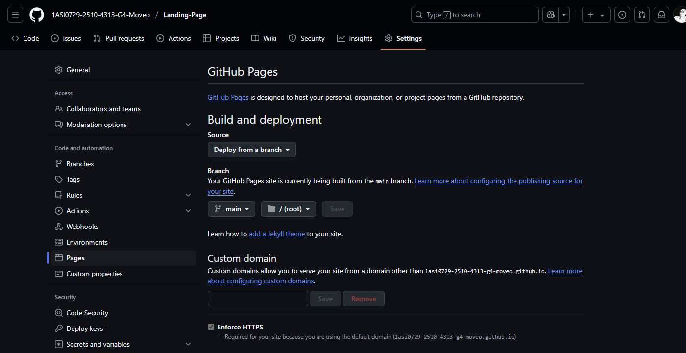

# **Capítulo V: Product Implementation, Validation & Deployment**
## 5.1. Software Configuration Management
### 5.1.1. Software Development Environment Configuration
### 5.1.2. Source Code Management

En nuestro proyecto, utilizamos **GitHub** como plataforma para gestionar el código fuente, manteniendo los siguientes repositorios:

- Report: https://github.com/1ASI0729-2510-4313-G4-Moveo/report
- Landing page: https://github.com/1ASI0729-2510-4313-G4-Moveo/Landing-Page
- Frontend: https://github.com/1ASI0729-2510-4313-G4-Moveo/frontend
- Backend: https://github.com/1ASI0729-2510-4313-G4-Moveo/backend

#### GitFlow Workflow
Se implementa el modelo de **GitFlow** para gestionar las ramas en nuestros repositorios. A continuación, se detallan las ramas principales:

##### Para el Reporte:

- **master**: Contiene las versiones estables del reporte.
- **develop**: Se utiliza para integrar las nuevas características antes de publicarlas en la rama master.
- **feature/\<número de capítulo>**: Rama creada para el desarrollo de funcionalidades del capítulo.

##### Para el Landing, Frontend y Backend:

- **main**: Contiene las versiones estables del reporte.
- **develop**: Se utiliza para integrar las nuevas características antes de publicarlas en la rama release/\<versión>.
- **hotfix**: Se utiliza para integrar caracteristicas urgentes que afectan el funcionamiento de la aplicación.
- **realease/\<Versión>**: Se utiliza para integrar las nuevas características antes de publicarlas en la rama main.
- **feature/\<nombre de funcionalidad>**: Rama creada para el desarrollo de funcionalidades específicas según el nombre. Las ramas se nombran en minúsculas siguiendo un esquema uniforme para mayor consistencia.

#### Conventional Commits
Se emplea para los mensajes de commmits el estándar de **Conventional Commits** con las siguientes etiquetas:

- **feat**: Nuevas características.
- **fix**: Corrección de errores.
- **docs**: Documentación.
- **style**: Modificaciones de estilos.
- **refactor**: Cambio de código que no corrige un error ni añade una característica.
- **perf**: Modificaciones que mejoran el rendimiento.
- **test**: Modificacciones en testing.
- **build**: Cambios que afectan al sistema de compilación o a dependencias externas.
- **ci**: Cambios en nuestros archivos y scripts de configuración CI.
- **chore**: Otros cambios que no modifican ficheros src o test
- **revert**: Revierte un commit anterior

### 5.1.3. Source Code Style Guide & Conventions
### 5.1.4. Software Deployment Configuration
Para la realizacion del despliegue debemos seguir los siguientes pasos:
  1. Primero, creamos un nuevo [repositorio en GitHub](https://github.com/1ASI0729-2510-4313-G4-Moveo/Landing-Page). Después, subimos los archivos del  proyecto a ese repositorio.
  2. Una vez que se haya subido todo, nos dirigimos a la configuración del repositorio. Allí, buscamos la sección de **"Pages"**, que aparece en la barra lateral izquierda.
  3. Luego, se vera una opción que permite seleccionar la rama desde la cual quieres hacer el despliegue. Normalmente, se elige **main**.
  4. Después de esto, GitHub generará automáticamente una URL para tu sitio.
 

## 5.2. Landing Page, Services & Applications Implementation
### 5.2.1. Sprint 1
#### 5.2.1.1. Sprint Planning 1
#### 5.2.1.2. Aspect Leaders and Collaborators
#### 5.2.1.3. Sprint Backlog 1
#### 5.2.1.4. Development Evidence for Sprint Review
#### 5.2.1.5. Execution Evidence for Sprint Review
#### 5.2.1.6. Services Documentation Evidence for Sprint Review
Para el Sprint 1, no se ha trabajado en la documentación de los servicios de la aplicación, ya que el enfoque principal ha sido la creación del Landing Page. No obstante, se tiene previsto desarrollar la documentación de los servicios en los próximos sprints. Sin embargo, se adjunta la url del repositorio que contenera los servicios.

URL del repositorio de Web Services: https://github.com/1ASI0729-2510-4313-G4-Moveo/backend

#### 5.2.1.7. Software Deployment Evidence for Sprint Review
#### 5.2.1.8. Team Collaboration Insights during Sprint
## 5.3. Validation Interviews
### 5.3.1. Diseño de Entrevistas
### 5.3.2. Registro de Entrevistas
### 5.3.3. Evaluaciones según heurísticas
## 5.4. Video About-the-Product

## Conclusiones
## Referencias bibliográficas
## Anexos