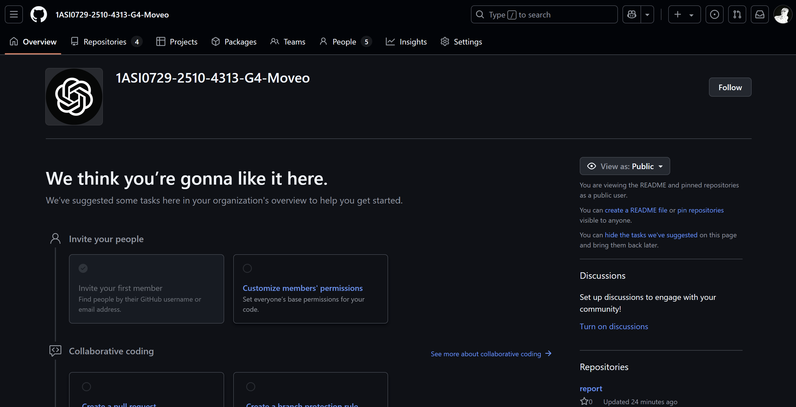
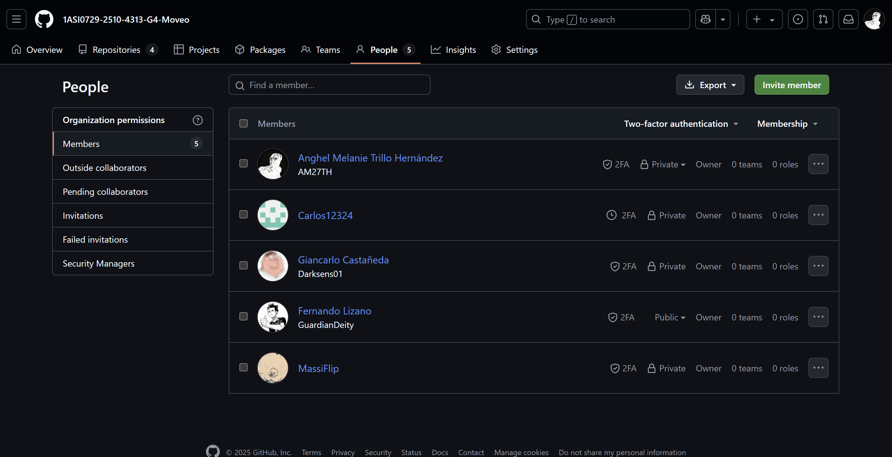
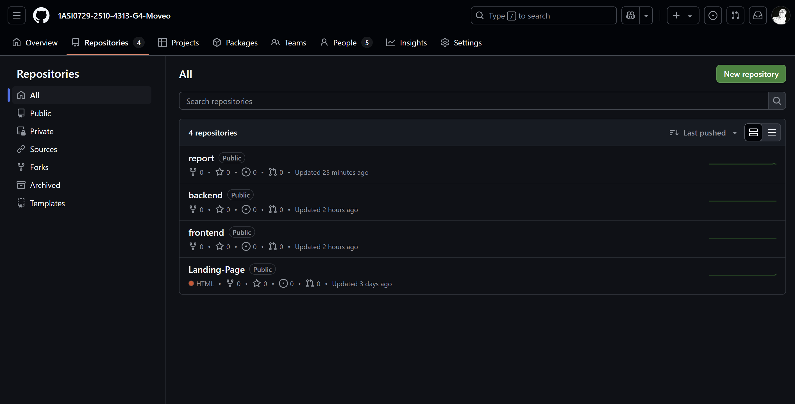

<style>
  body {
    font-family: 'Times New Roman', sans-serif;
    text-align: justify;
    font-size: 12px;
    margin-left: 2em;
    margin-right: 2em;
    line-height: 2;
  }
  
  p {
    text-indent: 2em; /* Sangría en el primer renglón de cada párrafo */
  }

  h1 {
    margin-left: 0; /* No aplica sangría para el título principal */
  }

  h2 {
    margin-left: 0; /* No aplica sangría para subtítulos de nivel 2 */
  }

  h3 {
    margin-left: 2em; /* Aplica una sangría de 2em para subtítulos de nivel 3 */
  }

  h4 {
    margin-left: 4em; /* Aplica una sangría de 4em para subtítulos de nivel 4 */
  }
</style>

# **Capítulo V: Product Implementation, Validation & Deployment**
## 5.1. Software Configuration Management
### 5.1.1. Software Development Environment Configuration

Esta sección establece el listado oficial del software, herramientas y plataformas que los miembros del equipo de la startup usaron para garantizar coherencia, colaboración y eficiencia en la construcción y mantenimiento de la web application.

| **Actividad**             | **Producto**        | **Propósito**                                                            | **Ruta de referencia**                             |
|---------------------------|---------------------|--------------------------------------------------------------------------|--------------------------------------------------|
| **Project Management**     | Jira                | Planificación, seguimiento y gestión de tareas ágiles. (Sprints, Product Backlog, etc.) | [Jira](https://moveo-upc.atlassian.net/)          |
| **Product UX/UI Design**   | Figma               | Diseño de interfaces de usuario, landing page y prototipado               | [Figma](https://figma.com)                       |
| **Software Development**   | Visual Studio Code  | Edición y desarrollo de código para interfaces web y móvil               | [Visual Studio Code](https://code.visualstudio.com/) |
| **Software Deployment**    | Github Pages        | Despliegue de la landing Page                                             | [Github Pages](https://pages.github.com/)        |
| **Software Documentation** | Markdown + StackEdit.io | Redacción y despliegue de documentación técnica.                          | [StackEdit.io](https://stackedit.io)             |
| **Version Control**        | GIT (Github)        | Control de versiones y revisiones de código                               | [Github](https://github.com)                     |

### 5.1.2. Source Code Management

En nuestro proyecto, utilizamos **GitHub** como plataforma para gestionar el código fuente, manteniendo los siguientes repositorios:

- Report: https://github.com/1ASI0729-2510-4313-G4-Moveo/report
- Landing page: https://github.com/1ASI0729-2510-4313-G4-Moveo/Landing-Page
- Frontend: https://github.com/1ASI0729-2510-4313-G4-Moveo/frontend
- Backend: https://github.com/1ASI0729-2510-4313-G4-Moveo/backend

#### GitFlow Workflow
Se implementa el modelo de **GitFlow** para gestionar las ramas en nuestros repositorios. A continuación, se detallan las ramas principales:

##### Para el Reporte:

- **master**: Contiene las versiones estables del reporte.
- **develop**: Se utiliza para integrar las nuevas características antes de publicarlas en la rama master.
- **feature/\<número de capítulo>**: Rama creada para el desarrollo de funcionalidades del capítulo.

##### Para el Landing, Frontend y Backend:

- **main**: Contiene las versiones estables del reporte.
- **develop**: Se utiliza para integrar las nuevas características antes de publicarlas en la rama release/\<versión>.
- **hotfix**: Se utiliza para integrar caracteristicas urgentes que afectan el funcionamiento de la aplicación.
- **realease/\<Versión>**: Se utiliza para integrar las nuevas características antes de publicarlas en la rama main.
- **feature/\<nombre de funcionalidad>**: Rama creada para el desarrollo de funcionalidades específicas según el nombre. Las ramas se nombran en minúsculas siguiendo un esquema uniforme para mayor consistencia.


#### Conventional Commits
Se emplea para los mensajes de commmits el estándar de **Conventional Commits** con las siguientes etiquetas:

- **feat**: Nuevas características.
- **fix**: Corrección de errores.
- **docs**: Documentación.
- **style**: Modificaciones de estilos.
- **refactor**: Cambio de código que no corrige un error ni añade una característica.
- **perf**: Modificaciones que mejoran el rendimiento.
- **test**: Modificacciones en testing.
- **build**: Cambios que afectan al sistema de compilación o a dependencias externas.
- **ci**: Cambios en nuestros archivos y scripts de configuración CI.
- **chore**: Otros cambios que no modifican ficheros src o test
- **revert**: Revierte un commit anterior

### 5.1.3. Source Code Style Guide & Conventions


Usaremos buenas prácticas para que el código sea coherente, entendible y sostenible a lo largo del tiempo.

### General

- Todo el código y sus elementos estarán escritos en **inglés**.
- La codificación será en **UTF-8**: `<meta charset="UTF-8">`.
- Convenciones en nombres:
  - **lowercase** para etiquetas HTML.
  - **kebab-case** para clases CSS.
  - **camelCase** para IDs, variables y funciones en JavaScript.
  - **PascalCase** para clases en C#.
- Indentación uniforme: 2 o 4 espacios (según el proyecto).
- Comentarios claros y en inglés, explicando el *por qué*, no solo el *qué*.

### HTML

- Todas las etiquetas deben cerrarse correctamente (``, `<input />`).
- Incluir la extensión en las referencias a archivos (.css, .js, .png, etc.).
- Se utilizó una estructura semántica clara:

| Etiqueta | Uso |
|---------|-----|
| `<header>` | Contiene elementos introductorios como la barra de búsqueda. |
| `<nav>` | Define la navegación principal del sitio. |
| `<div>` | Contenedor general para aplicar estilos y organizar el layout. |
| `` | Inserta imágenes en distintas secciones. |
| `<ul>` | Define listas desordenadas (ej. menú de navegación). |
| `<li>` | Elementos dentro de listas, como en la barra de navegación o en el blog. |
| `<a>` | Crea hipervínculos para navegar entre secciones. |
| `<p>` | Define párrafos de texto. |
| `<button>` | Botones para acciones específicas del usuario. |
| `<h1>` - `<h4>` | Títulos y subtítulos jerárquicos. |

### CSS

- El `body` tendrá `width: 100%`.
- Clases en `kebab-case` según su propósito: `.header`, `.main-container`, `.cta-button`.
- No se deben usar nombres genéricos como `.red`, `.big` o `.centered`.
- Reinicio global de márgenes y padding:

```
* {
  margin: 0;
  padding: 0;
  box-sizing: border-box;
}
```

### 5.1.4. Software Deployment Configuration
Para la realizacion del despliegue debemos seguir los siguientes pasos:
  1. Primero, creamos un nuevo [repositorio en GitHub](https://github.com/1ASI0729-2510-4313-G4-Moveo/Landing-Page). Después, subimos los archivos del  proyecto a ese repositorio.
  2. Una vez que se haya subido todo, nos dirigimos a la configuración del repositorio. Allí, buscamos la sección de **"Pages"**, que aparece en la barra lateral izquierda.
  3. Luego, se vera una opción que permite seleccionar la rama desde la cual quieres hacer el despliegue. Normalmente, se elige **main**.
  4. Después de esto, GitHub generará automáticamente una URL para tu sitio.
<br>


## 5.2. Landing Page, Services & Applications Implementation
### 5.2.1. Sprint 1
#### 5.2.1.1. Sprint Planning 1

**Sprint Planning Background**                                                                                               
| Criterio    | Detalle     |
| :----------------- | -------- |                                      
| Date      | 2025-18-04   |
| Time      | 12:00pm        |
| Location   | Reunión Virtual en Virtual google meet |
| Prepared By     | Giancarlo Castañeda       |
| Attendees (to planning meeting) | Carlos Gonzales, Fernando Lizano, Javier Nikaido, Anghel Trillo |
| Sprint 1 Review Summary  | Se realizó la landing page implementada con css y html, a raiz de los mockups y wireframes del diseño del landing page. |
| Sprint 1 Retrospective Summary | Mejorar la puntualidad en la entrega de artefactos. |

**Sprint Goal & User Stories** 

| Criterio  | Detalle   |
| :-------------- | -------------------- |
| Sprint 1 Goal  | Nuestro enfoque para este sprint es implementar la landing page de nuestro producto. Creemos que esto brindará una correcta presentación de nuestro producto hacia los visitantes. Esto se confirmará cuando todas las secciones de nuestra página web sean visitadas por cada visitante.  |
| Sprint 1 Velocity            | 23       |
| **Sum of Story Points**      | 23                                |

#### 5.2.1.2. Aspect Leaders and Collaborators

#### 5.2.1.3. Sprint Backlog 1
| User Story | Work-Item/Task | Id | Title | Description | Estimation (Hrs) | Assigned To | Status |
|:---|:---|:---|:---|:---|:---|:---|:---|
| us-1 | T1 | T1.1 | Registro de nuevos usuarios | Permitir a los nuevos usuarios registrarse en la plataforma Moveo. | 3 | Fernando Lizano | DONE |
| us-2 | T2 | T2.1 | Inicio de sesión seguro | Implementar un sistema de inicio de sesión seguro para usuarios registrados. | 2 | Fernando Lizano |DONE|
| us-6 | T6 | T6.1 | Implementación de Call to Action | Colocar botones de acción clara para facilitar la navegación. | 3 | Fernando Lizano | DONE |
| us-7 | T7 | T7.1 | Creación de Footer Informativo | Crear un pie de página con información de contacto y redes sociales. | 1 | Fernando Lizano | DONE |
| us-8 | T8 | T8.1 | Sección de Testimonios de Usuarios | Mostrar opiniones de usuarios anteriores para generar confianza. | 3 | Fernando Lizano | DONE |
| us-9 | T9 | T9.1 | Sección de Preguntas Frecuentes (FAQ) | Implementar una sección con respuestas a dudas comunes. | 2 | Fernando Lizano | DONE |
| us-10 | T10 | T10.1 | Visualización de estacionamientos en el mapa | Mostrar los estacionamientos disponibles para entrega/recogida. | 5 | Fernando Lizano | DONE |
| us-13 | T13 | T13.1 | Visualizar precios y tarifas | Mostrar los precios y tarifas de los autos disponibles. | 3 | Fernando Lizano |DONE |
| us-14 | T14 | T14.1 | Visualizar principales funciones | Mostrar en la web las funciones principales de Moveo. | 2 |  Fernando Lizano| DONE |
| us-15 | T15 | T15.1 | Ver el nombre, logo y eslogan de la aplicación | Mostrar claramente el logo, nombre y eslogan de Moveo. | 3 | Fernando Lizano | DONE |
| us-16 | T16 | T16.1 | Visualizar el nombre del equipo | Mostrar el nombre del equipo creador en la página. | 1 | Fernando Lizano, Javier Nikaido, Carlos Gonzales, Giancarlos Castañeda, Anghel Trillo| DONE |
| us-17 | T17 | T17.1 | Sección de contacto | Crear un formulario de contacto para dudas o soporte. | 3 | Fernando Lizano | DONE |
| us-18 | T18 | T18.1 | Landing Page Responsive | Adaptar la landing page para dispositivos móviles y escritorio. | 2 | Fernando Lizano | DONE |
#### 5.2.1.4. Development Evidence for Sprint Review
#### 5.2.1.5. Execution Evidence for Sprint Review
#### 5.2.1.6. Services Documentation Evidence for Sprint Review
Para el Sprint 1, no se ha trabajado en la documentación de los servicios de la aplicación, ya que el enfoque principal ha sido la creación del Landing Page. No obstante, se tiene previsto desarrollar la documentación de los servicios en los próximos sprints. Sin embargo, se adjunta la url del repositorio que contenera los servicios.

URL del repositorio de Web Services: https://github.com/1ASI0729-2510-4313-G4-Moveo/backend

#### 5.2.1.7. Software Deployment Evidence for Sprint Review
Se inicio con la creación de la organización en github. 



Posteriormente, se asocio a los integrantes del equipo para poder colaborar en los repositorios de la organización.



Luego, se crearon los repositorios del reporte, Landing Page, Frontend y Backend para organizar los productos entregables.



Finalmente, se configuro y desplegó la versión inicial del Landing Page en **GitHub Pages** desde la sección "Pages" seleccionando la rama **main**.


#### 5.2.1.8. Team Collaboration Insights during Sprint

## Conclusiones
- **Solución a una necesidad real:**
<br>Moveo logra cubrir la necesidad de movilidad flexible para trabajadores y turistas, ofreciendo una alternativa económica y conveniente frente al transporte público o taxis tradicionales.

- **Segmentación clara y efectiva:**
<br>Definir segmentos específicos (trabajadores y proveedores) permitió construir funcionalidades enfocadas que mejoran la experiencia de usuario de cada grupo.

- **Importancia de la experiencia de usuario:**
<br>El diseño UX/UI planteado en Figma priorizó la facilidad de uso, logrando flujos de navegación intuitivos y rápidos que favorecen el registro, reserva y provisión de autos.

- **Gestión técnica sólida:**
<br>La arquitectura propuesta en Structurizr permitió visualizar una estructura robusta de servicios, incluyendo pagos, historial de viajes y calificaciones, lo que garantiza escalabilidad para futuros crecimientos.

- **Trabajo colaborativo fundamental:**
<br>La construcción del proyecto demostró que una buena comunicación y división de tareas entre diseño, análisis y desarrollo es clave para avanzar de forma ágil y ordenada.

- **Futuro prometedor para Moveo:**
<br>El modelo de negocio y la plataforma tecnológica sentada en este proyecto tienen potencial para expandirse y consolidarse como un servicio de movilidad urbana relevante en el mercado.

## Recomendaciones
- **Fortalecer el trabajo en equipo:**
<br>Es importante mantener reuniones frecuentes y retrospectivas para revisar avances, identificar bloqueos y distribuir tareas de manera equitativa y estratégica.

- **Documentar todo el proceso:**
<br>Para proyectos futuros, registrar decisiones, cambios y justificaciones técnicas facilitará nuevas incorporaciones de miembros al equipo y reducirá la curva de aprendizaje.

- **Validación temprana con usuarios reales:**
<br>Antes de lanzar completamente, realizar pruebas piloto o MVP con usuarios reales permitirá ajustar funcionalidades, precios y flujos de manera basada en evidencia.

- **Actualización constante de la infraestructura:**
<br>Planificar actualizaciones periódicas en la API, seguridad de pagos y bases de datos asegurará que Moveo se mantenga competitivo y protegido frente a nuevas amenazas tecnológicas.

- **Ampliar la cultura de feedback:**
<br>Promover una cultura donde todos los miembros puedan dar y recibir feedback sincero, respetuoso y enfocado en mejorar el producto, ayuda a fortalecer la calidad final del trabajo.

- **Explorar futuras integraciones:**
<br>A largo plazo, considerar integrar Moveo con servicios externos como mapas inteligentes, seguros de viaje automáticos o asociaciones con parkings privados podría ampliar las fuentes de ingreso y la propuesta de valor.

## Referencias bibliográficas
- Ries, E. (2011). The Lean Startup: How Today's Entrepreneurs Use Continuous Innovation to Create Radically Successful Businesses. Crown Business.
https://www.amazon.com/Lean-Startup-Entrepreneurs-Continuous-Innovation/dp/0307887898

- Brown, T. (2009). Change by Design: How Design Thinking Creates New Alternatives for Business and Society. Harvard Business Press.
https://www.amazon.com/Change-Design-Creates-Alternatives-Business/dp/1422177807

- Katzenbach, J., & Smith, D.(1993). The Wisdom of Teams: Creating the High-Performance Organization. Harvard Business Review Press.
https://www.amazon.com/Wisdom-Teams-Creating-High-Performance-Organization/dp/0875843670

- Gehl, J. (2010). Cities for People. Island Press.
https://islandpress.org/books/cities-people

- Norman, D. A. (2013). The Design of Everyday Things: Revised and Expanded Edition. Basic Books.
https://www.basicbooks.com/titles/don-norman/the-design-of-everyday-things/9780465050659/
## Anexos
