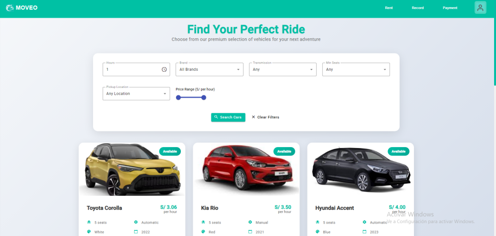
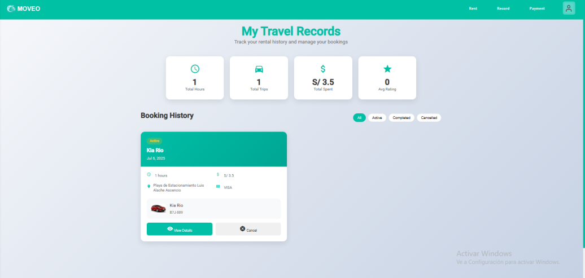
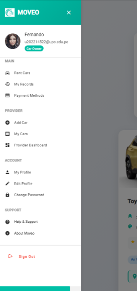
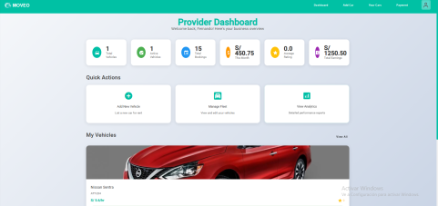
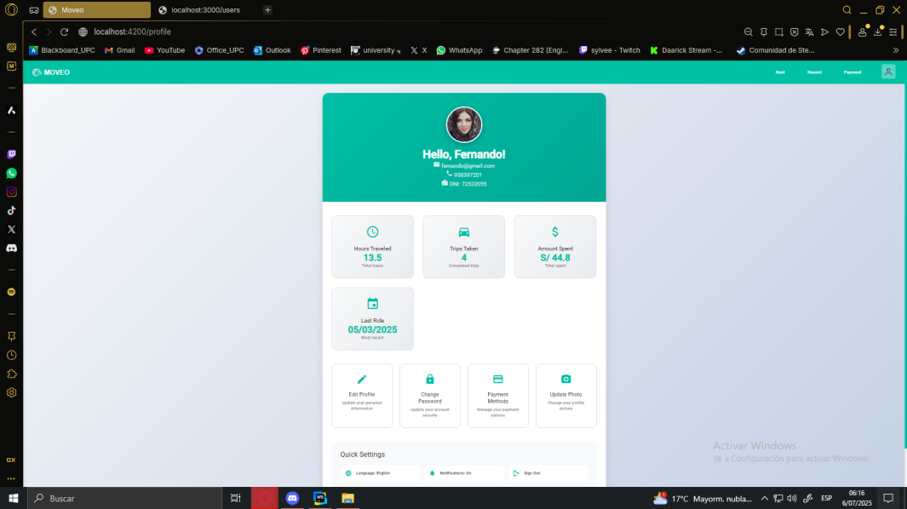
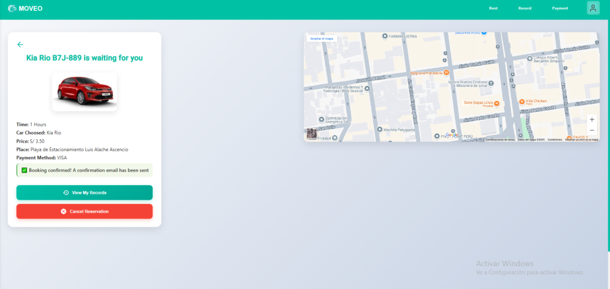
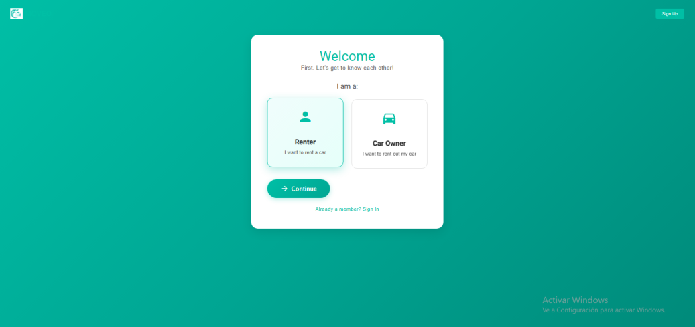

<style>
  body {
    font-family: 'Times New Roman', sans-serif;
    text-align: justify;
    font-size: 12px;
    margin-left: 2em;
    margin-right: 2em;
    line-height: 2;
  }
  
  p {
    text-indent: 2em; /* Sangría en el primer renglón de cada párrafo */
  }

  h1 {
    margin-left: 0; /* No aplica sangría para el título principal */
  }

  h2 {
    margin-left: 0; /* No aplica sangría para subtítulos de nivel 2 */
  }

  h3 {
    margin-left: 2em; /* Aplica una sangría de 2em para subtítulos de nivel 3 */
  }

  h4 {
    margin-left: 4em; /* Aplica una sangría de 4em para subtítulos de nivel 4 */
  }
</style>

# **Capítulo V: Product Implementation, Validation & Deployment**
## 5.1. Software Configuration Management
### 5.1.1. Software Development Environment Configuration

Esta sección establece el listado oficial del software, herramientas y plataformas que los miembros del equipo de la startup usaron para garantizar coherencia, colaboración y eficiencia en la construcción y mantenimiento de la web application.

| **Actividad**             | **Producto**        | **Propósito**                                                            | **Ruta de referencia**                             |
|---------------------------|---------------------|--------------------------------------------------------------------------|--------------------------------------------------|
| **Project Management**     | Jira                | Planificación, seguimiento y gestión de tareas ágiles. (Sprints, Product Backlog, etc.) | [Jira](https://moveo-upc.atlassian.net/)          |
| **Product UX/UI Design**   | Figma               | Diseño de interfaces de usuario, landing page y prototipado               | [Figma](https://figma.com)                       |
| **Software Development**   | Visual Studio Code  | Edición y desarrollo de código para interfaces web y móvil               | [Visual Studio Code](https://code.visualstudio.com/) |
| **Software Deployment**    | Github Pages        | Despliegue de la landing Page                                             | [Github Pages](https://pages.github.com/)        |
| **Software Documentation** | Markdown + StackEdit.io | Redacción y despliegue de documentación técnica.                          | [StackEdit.io](https://stackedit.io)             |
| **Version Control**        | GIT (Github)        | Control de versiones y revisiones de código                               | [Github](https://github.com)                     |

### 5.1.2. Source Code Management

En nuestro proyecto, utilizamos **GitHub** como plataforma para gestionar el código fuente, manteniendo los siguientes repositorios:

- Report: https://github.com/1ASI0729-2510-4313-G4-Moveo/report
- Landing page: https://github.com/1ASI0729-2510-4313-G4-Moveo/Landing-Page
- Frontend: https://github.com/1ASI0729-2510-4313-G4-Moveo/frontend
- Backend: https://github.com/1ASI0729-2510-4313-G4-Moveo/backend

#### GitFlow Workflow
Se implementa el modelo de **GitFlow** para gestionar las ramas en nuestros repositorios. A continuación, se detallan las ramas principales:

##### Para el Reporte:

- **master**: Contiene las versiones estables del reporte.
- **develop**: Se utiliza para integrar las nuevas características antes de publicarlas en la rama master.
- **feature/\<número de capítulo>**: Rama creada para el desarrollo de funcionalidades del capítulo.

##### Para el Landing, Frontend y Backend:

- **main**: Contiene las versiones estables del reporte.
- **develop**: Se utiliza para integrar las nuevas características antes de publicarlas en la rama release/\<versión>.
- **hotfix**: Se utiliza para integrar caracteristicas urgentes que afectan el funcionamiento de la aplicación.
- **realease/\<Versión>**: Se utiliza para integrar las nuevas características antes de publicarlas en la rama main.
- **feature/\<nombre de funcionalidad>**: Rama creada para el desarrollo de funcionalidades específicas según el nombre. Las ramas se nombran en minúsculas siguiendo un esquema uniforme para mayor consistencia.


#### Conventional Commits
Se emplea para los mensajes de commmits el estándar de **Conventional Commits** con las siguientes etiquetas:

- **feat**: Nuevas características.
- **fix**: Corrección de errores.
- **docs**: Documentación.
- **style**: Modificaciones de estilos.
- **refactor**: Cambio de código que no corrige un error ni añade una característica.
- **perf**: Modificaciones que mejoran el rendimiento.
- **test**: Modificacciones en testing.
- **build**: Cambios que afectan al sistema de compilación o a dependencias externas.
- **ci**: Cambios en nuestros archivos y scripts de configuración CI.
- **chore**: Otros cambios que no modifican ficheros src o test
- **revert**: Revierte un commit anterior

### 5.1.3. Source Code Style Guide & Conventions


Usaremos buenas prácticas para que el código sea coherente, entendible y sostenible a lo largo del tiempo.

### General

- Todo el código y sus elementos estarán escritos en **inglés**.
- La codificación será en **UTF-8**: `<meta charset="UTF-8">`.
- Convenciones en nombres:
  - **lowercase** para etiquetas HTML.
  - **kebab-case** para clases CSS.
  - **camelCase** para IDs, variables y funciones en JavaScript.
  - **PascalCase** para clases en C#.
- Indentación uniforme: 2 o 4 espacios (según el proyecto).
- Comentarios claros y en inglés, explicando el *por qué*, no solo el *qué*.

### HTML

- Todas las etiquetas deben cerrarse correctamente (``, `<input />`).
- Incluir la extensión en las referencias a archivos (.css, .js, .png, etc.).
- Se utilizó una estructura semántica clara:

| Etiqueta | Uso |
|---------|-----|
| `<header>` | Contiene elementos introductorios como la barra de búsqueda. |
| `<nav>` | Define la navegación principal del sitio. |
| `<div>` | Contenedor general para aplicar estilos y organizar el layout. |
| `` | Inserta imágenes en distintas secciones. |
| `<ul>` | Define listas desordenadas (ej. menú de navegación). |
| `<li>` | Elementos dentro de listas, como en la barra de navegación o en el blog. |
| `<a>` | Crea hipervínculos para navegar entre secciones. |
| `<p>` | Define párrafos de texto. |
| `<button>` | Botones para acciones específicas del usuario. |
| `<h1>` - `<h4>` | Títulos y subtítulos jerárquicos. |

### CSS

- El `body` tendrá `width: 100%`.
- Clases en `kebab-case` según su propósito: `.header`, `.main-container`, `.cta-button`.
- No se deben usar nombres genéricos como `.red`, `.big` o `.centered`.
- Reinicio global de márgenes y padding:

```
* {
  margin: 0;
  padding: 0;
  box-sizing: border-box;
}
```

### 5.1.4. Software Deployment Configuration
Para la realizacion del despliegue debemos seguir los siguientes pasos:
  1. Primero, creamos un nuevo [repositorio en GitHub](https://github.com/1ASI0729-2510-4313-G4-Moveo/Landing-Page). Después, subimos los archivos del  proyecto a ese repositorio.
  2. Una vez que se haya subido todo, nos dirigimos a la configuración del repositorio. Allí, buscamos la sección de **"Pages"**, que aparece en la barra lateral izquierda.
  3. Luego, se vera una opción que permite seleccionar la rama desde la cual quieres hacer el despliegue. Normalmente, se elige **main**.
  4. Después de esto, GitHub generará automáticamente una URL para tu sitio.
<br>


## 5.2. Landing Page, Services & Applications Implementation
### 5.2.1. Sprint 1
#### 5.2.1.1. Sprint Planning 1

**Sprint Planning Background**
<table>
  <tr>
    <th>Criterio</th>
    <th>Detalle</th>
  </tr>
  <tr>
    <td>Date</td>
    <td>2025-18-04</td>
  </tr>
  <tr>
    <td>Time</td>
    <td>12:00pm</td>
  </tr>
  <tr>
    <td>Location</td>
    <td>Reunión Virtual en Virtual google meet</td>
  </tr>
  <tr>
    <td>Prepared By</td>
    <td>Giancarlo Castañeda</td>
  </tr>
  <tr>
    <td>Attendees (to planning meeting)</td>
    <td>Carlos Gonzales, Fernando Lizano, Javier Nikaido, Anghel Trillo</td>
  </tr>
  <tr>
    <td>Sprint 1 Review Summary</td>
    <td>Se realizó la landing page implementada con CSS y HTML, a raíz de los mockups y wireframes del diseño del landing page.</td>
  </tr>
  <tr>
    <td>Sprint 1 Retrospective Summary</td>
    <td>Mejorar la puntualidad en la entrega de artefactos.</td>
  </tr>
</table>


**Sprint Goal & User Stories** 

| Criterio  | Detalle   |
| :-------------- | -------------------- |
| Sprint 1 Goal  | Nuestro enfoque para este sprint es implementar la landing page de nuestro producto. Creemos que esto brindará una correcta presentación de nuestro producto hacia los visitantes. Esto se confirmará cuando todas las secciones de nuestra página web sean visitadas por cada visitante.  |
| Sprint 1 Velocity            | Para este sprint nuestro equipo puende aceptar hasta 25 story points       |
| **Sum of Story Points**      | Para este sprint haremos 23 story points                                |

#### 5.2.1.2. Aspect Leaders and Collaborators

| Team Member (Last Name, First Name)  | GitHub Username | Aspect Diseño UX/UI y Prototipado (L/C) | Aspect Programación de la Landing Page (L/C) | Aspect Arquitectura de Información y Sistemas de Organización/Navegación (L/C) |
| ------------------------------------ | --------------- | --------------------------------------- | -------------------------------------------- | --------------------------------------------------------------------------------------------- |
| Castañeda Guimas, Giancarlo Santiago | Darksens01      | L                                       | L                                            | C                                                                                             |
| Gonzales Valverde, Carlos Matthew    | Carlos12324     | C                                       | L                                            | L                                                                                             |
| Nikaido Vargas, Javier Nikaido       | MassiFlip       | L                                       | C                                            | C                                                                                             |
| Lizano Coll Cardenas, Fernando Jesus | GuardianDeity   | L                                       | C                                            | L                                                                                             |
| Trillo Hernandez, Anghel Melanie     | AM27TH          | C                                       | C                                            | L                                                                                             |

#### 5.2.1.3. Sprint Backlog 1
| User Story | Work-Item/Task | Id | Title | Description | Estimation (Hrs) | Assigned To | Status |
|:---|:---|:---|:---|:---|:---|:---|:---|
| us-6 | T6 | T6.1 | Implementación de Call to Action | Colocar botones de acción clara para facilitar la navegación. | 5 | Fernando Lizano | DONE |
| us-7 | T7 | T7.1 | Creación de Footer Informativo | Crear un pie de página con información de contacto y redes sociales. | 4 | Fernando Lizano | DONE |
| us-8 | T8 | T8.1 | Sección de Testimonios de Usuarios | Mostrar opiniones de usuarios anteriores para generar confianza. | 6 | Fernando Lizano | DONE |
| us-9 | T9 | T9.1 | Sección de Preguntas Frecuentes (FAQ) | Implementar una sección con respuestas a dudas comunes. | 5 | Fernando Lizano | DONE |
| us-10 | T10 | T10.1 | Visualización de estacionamientos en el mapa | Mostrar los estacionamientos disponibles para entrega/recogida. | 5 | Fernando Lizano | DONE |
| us-13 | T13 | T13.1 | Visualizar precios y tarifas | Mostrar los precios y tarifas de los autos disponibles. | 5 | Fernando Lizano |DONE |
| us-14 | T14 | T14.1 | Visualizar principales funciones | Mostrar en la web las funciones principales de Moveo. | 4 |  Fernando Lizano| DONE |
| us-15 | T15 | T15.1 | Ver el nombre, logo y eslogan de la aplicación | Mostrar claramente el logo, nombre y eslogan de Moveo. | 4 | Fernando Lizano | DONE |
| us-16 | T16 | T16.1 | Visualizar el nombre del equipo | Mostrar el nombre del equipo creador en la página. | 4 | Fernando Lizano, Javier Nikaido, Carlos Gonzales, Giancarlos Castañeda, Anghel Trillo| DONE |
| us-17 | T17 | T17.1 | Sección de contacto | Crear un formulario de contacto para dudas o soporte. | 5 | Fernando Lizano | DONE |
| us-18 | T18 | T18.1 | Landing Page Responsive | Adaptar la landing page para dispositivos móviles y escritorio. | 5 | Fernando Lizano | DONE |
#### 5.2.1.4. Development Evidence for Sprint Review
A continuación se muestran los commits realizados por los integrantes del equipo, se obviaron los merges y commits incorrectos por razones de mejor visualización acerca de los commits correctamente desarrollados e implementados:

| Repository  | Branch  | Commit Id  | Commit Message  | Commit Message Body  | Commited on (Date) |
| :---- | :---- | :---- | :---- | :---- | :---- |
| 1ASI0729-2510-4313-G4-Moveo landing\_page | feature-customers | 3e6d460 | feat(index): add scroll top function and content | \* No aplica  | 20/04/2025 |
| 1ASI0729-2510-4313-G4-Moveo landing\_page | feature-customers| a04bacf | feat(index): add map area content | \* No aplica | 20/04/2025 |
| 1ASI0729-2510-4313-G4-Moveo landing\_page | feature-customers | d4b4511 | feat(index): add contact area content | \* No aplica  | 20/04/2025 |
| 1ASI0729-2510-4313-G4-Moveo landing\_page | feature-customers| 3ccab7e | style: add styles for contact and map area content | \* No aplica | 20/04/2025 |
| 1ASI0729-2510-4313-G4-Moveo landing\_page | feature-customers | 40ba33d | style: add styles for testimonial area content | \* No aplica  | 20/04/2025 |
| 1ASI0729-2510-4313-G4-Moveo landing\_page | feature-hero | df0b9f4 | style: add styles for features area content  | \* No aplica | 20/04/2025 |
| 1ASI0729-2510-4313-G4-Moveo landing\_page | feature-hero | 48b0f4b | feat(index): add features area content | \* No aplica | 20/04/2025 |
| 1ASI0729-2510-4313-G4-Moveo landing\_page | feature-hero | 4bf4b47 | feat: add me.svg into assets\images\somethings | \* No aplica | 20/04/2025 |
| 1ASI0729-2510-4313-G4-Moveo landing\_page | feature-hero | 26468c9 | feat: add main.svg into assets\images\somethings | \* No aplica | 20/04/2025 |
| 1ASI0729-2510-4313-G4-Moveo landing\_page | feature-hero | 804fd1f | style: add styles for hero area content | \* No aplica | 20/04/2025 |
| 1ASI0729-2510-4313-G4-Moveo landing\_page | feature-services | 06d709e | style: add styles for pricing area content  | \* No aplica | 20/04/2025 |
| 1ASI0729-2510-4313-G4-Moveo landing\_page | feature-services | f00f946 | feat: add pricing area content | \* No aplica | 20/04/2025 |
| 1ASI0729-2510-4313-G4-Moveo landing\_page | feature-services | 86704c7 | feat: add styles for services area content | \* No aplica | 20/04/2025 |
| 1ASI0729-2510-4313-G4-Moveo landing\_page | feature-services | 465a3f8 | feat: add services area content | \* No aplica | 20/04/2025 |
| 1ASI0729-2510-4313-G4-Moveo landing\_page | feature-services | 29d38ab | Merge branch 'feature-hero' into develop | \* No aplica | 20/04/2025 |
| 1ASI0729-2510-4313-G4-Moveo landing\_page | feature-team | 14db7cb | style: add styles for team area content | \* No aplica | 20/04/2025 |
| 1ASI0729-2510-4313-G4-Moveo landing\_page | feature-team | 9ebbce7 | feat(index): add team area content | \* No aplica | 20/04/2025 |
| 1ASI0729-2510-4313-G4-Moveo landing\_page | feature-team | 90b0bf7 | style: add styles for video area content | \* No aplica | 20/04/2025 |
| 1ASI0729-2510-4313-G4-Moveo landing\_page | feature-team | 0bbb3c9 | feat(index): add video area content | \* No aplica | 20/04/2025 |
| 1ASI0729-2510-4313-G4-Moveo landing\_page | feature-team | f00f946 | feat: add pricing area content | \* No aplica | 20/04/2025 |
| 1ASI0729-2510-4313-G4-Moveo landing\_page | feature-headersandfooter   | ede3143 | style: add footer area style content | \* No aplica | 20/04/2025 |
| 1ASI0729-2510-4313-G4-Moveo landing\_page | feature-headersandfooter   | c755442 | feat(index): add footer area content | \* No aplica | 20/04/2025 |
| 1ASI0729-2510-4313-G4-Moveo landing\_page | feature-headersandfooter   | 556aeea | feat: add moveo_icon_white.svg into assets\images\logo | \* No aplica | 20/04/2025 |
| 1ASI0729-2510-4313-G4-Moveo landing\_page | feature-headersandfooter   | 61214ea | feat: add moveo_icon_color.svg into assets\images\logo | \* No aplica | 20/04/2025 |
| 1ASI0729-2510-4313-G4-Moveo landing\_page | feature-headersandfooter   | ff76265 | style: add content for normalize and titles from css | \* No aplica | 20/04/2025 |

#### 5.2.1.5. Execution Evidence for Sprint Review


#### 5.2.1.6. Services Documentation Evidence for Sprint Review
Para el Sprint 1, no se ha trabajado en la documentación de los servicios de la aplicación, ya que el enfoque principal ha sido la creación del Landing Page. No obstante, se tiene previsto desarrollar la documentación de los servicios en los próximos sprints. Sin embargo, se adjunta la url del repositorio que contenera los servicios.

URL del repositorio de Web Services: https://github.com/1ASI0729-2510-4313-G4-Moveo/backend

#### 5.2.1.7. Software Deployment Evidence for Sprint Review
Se inicio con la creación de la organización en github. 


Posteriormente, se asocio a los integrantes del equipo para poder colaborar en los repositorios de la organización.


Luego, se crearon los repositorios del reporte, Landing Page, Frontend y Backend para organizar los productos entregables.


Finalmente, se configuro y desplegó la versión inicial del Landing Page en **GitHub Pages** desde la sección "Pages" seleccionando la rama **main**.


#### 5.2.1.8. Team Collaboration Insights during Sprint

| Participante | Actividades de implementación |
| :---- | :---- |
| Lizano Coll Cardenas, Fernando Jesus | Nav bar, About us section, Our Services, Pricing & Plans, Watch our video, Meet our team, Our Testimonials, FAQ, Contact Us, Footer|
| Gonzales Valverde | Images adaptation, Traduction en-es |
| Castañeda Guimas, Giancarlo Santiago, Trillo Hernandez, Anghel Melanie, Nikaido Vargas, Javier Masaru  | Organization fixes |


### 5.2.2. Sprint 2
#### 5.2.2.1. Sprint Planning 2

**Sprint Planning Background**
<table>
  <tr>
    <th>Criterio</th>
    <th>Detalle</th>
  </tr>
  <tr>
    <td>Date</td>
    <td>2025-13-05</td>
  </tr>
  <tr>
    <td>Time</td>
    <td>12:00pm</td>
  </tr>
  <tr>
    <td>Location</td>
    <td>Reunión Virtual en Virtual google meet</td>
  </tr>
  <tr>
    <td>Prepared By</td>
    <td>Giancarlo Castañeda</td>
  </tr>
  <tr>
    <td>Attendees (to planning meeting)</td>
    <td>Carlos Gonzales, Fernando Lizano, Javier Nikaido, Anghel Trillo</td>
  </tr>
  <tr>
    <td>Sprint 2 Review Summary</td>
    <td>Se realizó la app web, integrandole las funcionalidades core y desarrollando el diseño de esta. Para ello </td>
  </tr>
  <tr>
    <td>Sprint 2 Retrospective Summary</td>
    <td>Mejorar la puntualidad en la entrega de artefactos, optimizar la entrega de trabajos.</td>
  </tr>

**Sprint Goal & User Stories** 

| Criterio  | Detalle   |
| :-------------- | -------------------- |
| Sprint 2 Goal  | Nuestro enfoque para este sprint es implementar la landing page de nuestro producto. Creemos que esto brindará una correcta presentación de nuestro producto hacia los visitantes. Esto se confirmará cuando todas las secciones de nuestra página web sean visitadas por cada visitante.  |
| Sprint 2 Velocity            | Para este sprint nuestro equipo puende aceptar hasta 25 story points       |
| **Sum of Story Points**      | Para este sprint haremos 23 story points                                |

#### 5.2.1.2. Aspect Leaders and Collaborators

| Team Member (Last Name, First Name)  | GitHub Username | Aspect Diseño UX/UI y Prototipado (L/C) | Aspect Programación de la app web (L/C)      | Aspect Arquitectura de Información y Sistemas de Organización/Navegación (L/C) |
| ------------------------------------ | --------------- | --------------------------------------- | -------------------------------------------- | --------------------------------------------------------------------------------------------- |
| Castañeda Guimas, Giancarlo Santiago | Darksens01      | L                                       | C                                            | C                                                                                             |
| Gonzales Valverde, Carlos Matthew    | Carlos12324     | L                                       | L                                            | L                                                                                             |
| Nikaido Vargas, Javier Nikaido       | MassiFlip       | L                                       | C                                            | C                                                                                             |
| Lizano Coll Cardenas, Fernando Jesus | GuardianDeity   | L                                       | L                                            | L                                                                                             |
| Trillo Hernandez, Anghel Melanie     | AM27TH          | L                                       | L                                            | L                                                                                             |

#### 5.2.2.3. Sprint Backlog 2
| User Story | Work-Item/Task | Id | Title | Description | Estimation (Hrs) | Assigned To | Status |
|:---|:---|:---|:---|:---|:---|:---|:---|
| US01 | T1 | T1-1 | Registro de nuevos usuarios | Crear pantalla de registro de usuarios | 4 | Carlos Matthew | DONE |
| US02 | T2 | T2-1 | Inicio de sesión seguro | Creación y almacenamiento de usuarios para la pantalla inicio de sesión  | 4 | Carlos Matthew |DONE|
| US23 | T23 | T23-1 | Visualizar historial de uso | Creación y codificación de el historial de uso de los usuarios | 5 | Carlos Matthew, Javier Masaru | DONE |
| US24 | T24 | T24-1 | Visualizar y editar metodos de pago | Creación, edició y eliminación de los metodos de pago | 6 | Carlos Matthew, Javier Masaru  | DONE |
| TS01 | T6 | T6-1 | Diseño adaptable (responsive) | Realizar diseño responsive a la app web | 6 | Carlos Matthew | DONE |
| TS04 | T7 | T7-1 | Funcionalidad CRUD en la interfaz | Agregar funcionalidades CRUD a la app web  | 5 | Carlos Matthew |DONE |
| TS05 | T8 | T8-1 | Despliegue de la aplicación | Desplegar la aplicación en un entorno seguro | 5 | Carlos Matthew | DONE |
| TS06 | T9 | T9-1 | Configuración de las rutas principales | Asignar rutas para mejorar la fluidez de la app | 6 | Carlos Matthew | DONE |

#### 5.2.2.4. Development Evidence for Sprint Review
A continuación se muestran los commits realizados por los integrantes del equipo, se obviaron los merges y commits incorrectos por razones de mejor visualización acerca de los commits correctamente desarrollados e implementados:


#### 5.2.2.5. Execution Evidence for Sprint Review


#### 5.2.2.6. Services Documentation Evidence for Sprint Review
Para el Sprint 2, no se ha trabajado en la documentación de los servicios de la aplicación, ya que el enfoque principal ha sido la creación del Landing Page. No obstante, se tiene previsto desarrollar la documentación de los servicios en los próximos sprints. Sin embargo, se adjunta la url del repositorio que contenera los servicios.

URL del repositorio de Web Services: https://github.com/1ASI0729-2510-4313-G4-Moveo/backend

#### 5.2.2.7. Software Deployment Evidence for Sprint Review
Para esta entrega no pudimos realizar el deploy, intentaremos realizarlo para la siguiente entrega

#### 5.2.2.8. Team Collaboration Insights during Sprint


| Participante                                                                                                                          | Actividades de implementación |
|:--------------------------------------------------------------------------------------------------------------------------------------| :---- |
| Lizano Coll Cardenas, Fernando. Castañeda Guimas, Giancarlo Santiago, Trillo Hernandez, Anghel Melanie, Nikaido Vargas, Javier Masaru | Organization fixes |
| Carlos Matthew                                                                                                                        | Creación de la app web |

### 5.2.3. Sprint 3
#### 5.2.3.1.Sprint Planning 3.

| Sprint \# | 3 |
| :---- | :---- |
| Sprint # | 3 |
| :---- | :---- |
| Sprint Planning Background | |
| Date | 2025-06-15 |
| Time | 12:00 PM |
| Location | Discord |
| Prepared by | Giancarlo Castañeda |
| Attendees (to planning meeting) | Fernando Lizano, Carlos Matthew, Masaru Nikaido, Anghel Trillo |
| Sprint n – 3 Review Summary | Se avanzó en la estructura de base de datos; además, se ajustaron los endpoints a la arquitectura final definida. |
| Sprint n – 3 Retrospective Summary | Consolidar la conexión entre frontend y backend para garantizar integraciones más rápidas. Aumentar y conseguir terminar con los endpoints propuestos |
| Sprint 3 Goal | En este Sprint, nuestro objetivo es tener implementados los endpoints principales, asegurar la conexión estable con el frontend y avanzar en la documentación técnica completa del backend. Esto se validará cuando los endpoints estén funcionales y documentados, y exista una integración estable entre backend y frontend. |
| Sprint 3 Velocity | Para este sprint nuestro equipo puede aceptar hasta 50 story points |
| Sum of Story Points | 49 story points |

#### 5.2.3.2. Aspect Leaders and Collaborators.
| Team Member (Last Name, First Name)  | GitHub Username | Aspect Diseño UX/UI y Prototipado (L/C) | Aspect Programación de la app web (L/C)      | Aspect Arquitectura de Información y Sistemas de Organización/Navegación (L/C) |
| ------------------------------------ | --------------- | --------------------------------------- | -------------------------------------------- | --------------------------------------------------------------------------------------------- |
| Castañeda Guimas, Giancarlo Santiago | Darksens01      | L                                       | C                                            | C                                                                                             |
| Gonzales Valverde, Carlos Matthew    | Carlos12324     | L                                       | L                                            | L                                                                                             |
| Nikaido Vargas, Javier Nikaido       | MassiFlip       | L                                       | C                                            | C                                                                                             |
| Lizano Coll Cardenas, Fernando Jesus | GuardianDeity   | L                                       | L                                            | L                                                                                             |
| Trillo Hernandez, Anghel Melanie     | AM27TH          | L                                       | L                                            | L                                                                                             |

#### 5.2.3.3. Sprint Backlog 3

| Id | Title | Id | Title | Description | Estimation (Hours)  | Assigned To | Status (To-do / InProcess / ToReview / Done) |
| :---- | :---- | :---- | :---- | :---- | :---- | :---- | :---- |
| TS06 | Endpoint de IAM | T1 | Implementar POST, PUT, DELETE para IAM | Desarrollo de endpoints para crear, actualizar y eliminar usuarios. | 6 | Giancarlo Castañeda | To-do |
| TS06 | Endpoint de IAM | T2 | Implementar GET (GetById, GetAll) para IAM | Desarrollo de endpoints para obtener usuarios por ID y listado. | 5 | Giancarlo Castañeda | To-do |
| TS11 | Endpoint de Car | T1 | Implementar POST, PUT, DELETE para Car | Desarrollo de endpoints para registrar, actualizar y eliminar autos. | 6 | Giancarlo Castañeda | To-do |
| TS11 | Endpoint de Car | T2 | Implementar GET (GetById, GetAllAvailableCars) para Car | Desarrollo de endpoints para obtener autos disponibles. | 5 | Giancarlo Castañeda | To-do |
| TS07 | Endpoint de Rents | T1 | Implementar POST, PUT, DELETE para Rents | Desarrollo de endpoints para registrar, actualizar y cancelar rentas. | 6 | Giancarlo Castañeda | To-do |
| TS07 | Endpoint de Rents | T2 | Implementar GET (GetById, GetAll) para Rents | Desarrollo de endpoints para obtener rentas por ID y listado. | 5 | Giancarlo Castañeda | To-do |
| TS12 | Endpoint de CarStation | T1 | Implementar POST, PUT, DELETE para CarStation | Desarrollo de endpoints para registrar, actualizar y eliminar estaciones. | 6h | Giancarlo Castañeda | To-do |
| TS12 | Endpoint de CarStation | T2 | Implementar GET (GetById, GetAll) para CarStation | Desarrollo de endpoints para obtener estaciones. | 5 | Giancarlo Castañeda | To-do |
| TS08 | Endpoint de Payment | T1 | Implementar POST, PUT, DELETE para Payment | Desarrollo de endpoints para gestionar pagos de reservas. | 6 | Masaru Nikaido | To-do |
| TS08 | Endpoint de Payment | T2 | Implementar GET (GetById, GetAll) para Payment | Desarrollo de endpoints para consultar pagos. | 5 | Masaru Nikaido | To-do |
| TS09 | Endpoint de PaymentInformation | T1 | Implementar POST, PUT, DELETE para PaymentInformation | Desarrollo de endpoints para registrar, actualizar y eliminar métodos de pago. | 6h | Masaru Nikaido | To-do |
| TS09 | Endpoint de PaymentInformation | T2 | Implementar GET (GetById, GetAll) para PaymentInformation | Desarrollo de endpoints para obtener métodos de pago. | 5 | Masaru Nikaido | To-do |
| US33 | Métodos de pago | T1 | Desarrollo de lógica para registrar métodos de pago | Implementación en el servicio correspondiente. | 5 | Carlos Matthew | To-do |
| US34 | Edición de métodos de pago | T1 | Desarrollo de lógica para editar/eliminar métodos de pago | Implementación en el servicio correspondiente. | 5 | Carlos Matthew | To-do |
| US35 | Edición de perfil | T1 | Desarrollo de lógica para editar información de perfil | Implementación en el servicio correspondiente. | 5 | Carlos Matthew | To-do |
| US36 | Cambio de contraseña | T1 | Desarrollo de lógica para cambiar contraseña de usuario | Implementación en el servicio correspondiente. | 5 | Carlos Matthew | To-do |
| TS05 | Endpoint de Providing | T1 | Implementar POST, PUT, DELETE para Providing | Desarrollo de endpoints para gestionar oferta de autos. | 6 | Anghel Trillo | To-do |
| TS05 | Endpoint de Providing | T2 | Implementar GET (GetById, GetAll) para Providing | Desarrollo de endpoints para obtener ofertas de autos. | 5 | Anghel Trillo | To-do |
| TS04 | Endpoint de ProvidedCarRecord | T1 | Implementar POST, PUT, DELETE para ProvidedCarRecord | Desarrollo de endpoints para gestionar registros de autos. | 6 | Anghel Trillo | To-do |
| TS04 | Endpoint de ProvidedCarRecord | T2 | Implementar GET (GetById, GetAll) para ProvidedCarRecord | Desarrollo de endpoints para obtener registros de autos. | 5 | Anghel Trillo | To-do |
| TS10 | Endpoint de Record | T1 | Implementar POST, PUT, DELETE para Record | Desarrollo de endpoints para registrar logs. | 6 | Fernando Lizando | To-do |
| TS10 | Endpoint de Record | T2 | Implementar GET (GetById, GetAll) para Record | Desarrollo de endpoints para consultar logs. | 5 | Fernando Lizando | To-do |
| US23 | Need Finding | T1 | Investigación y levantamiento de necesidades de usuarios | Realización de entrevistas y análisis de resultados. | 6 | Giancarlo Castañeda | To-do |
| US24 | User Task Matrix | T1 | Mapeo de tareas principales de los usuarios | Desarrollo del documento de matriz de tareas. | 5 | Giancarlo Castañeda | To-do |
| US25 | User Journey Map | T1 | Elaboración de mapas de recorrido de usuario | Identificación de puntos críticos y oportunidades de mejora. | 6 | Giancarlo Castañeda | To-do |
| US26 | Empathy Mapping | T1 | Creación de mapas de empatía | Identificación de emociones, pensamientos y frustraciones. | 5 | Giancarlo Castañeda | To-do |
| US27 | Scenario Mapping | T1 | Elaboración de escenarios As-Is y To-Be | Definición y documentación de escenarios actuales e ideales. | 5 | Giancarlo Castañeda | To-do |
| US28 | Impact Mapping | T1 | Creación de mapa de impacto | Relación entre objetivos de negocio y funcionalidades. | 6 | Giancarlo Castañeda | To-do |
| US29 | Product Backlog | T1 | Construcción y priorización del backlog | Documentación de funcionalidades esenciales. | 5 | Giancarlo Castañeda | To-do |
| US30 | Modelado C4 | T1 | Modelado de contexto en C4 | Elaboración del nivel de contexto. | 5 | Giancarlo Castañeda | To-do |
| US30 | Modelado C4 | T2 | Modelado de contenedores en C4 | Elaboración del nivel de contenedores. | 5 | Giancarlo Castañeda | To-do |
| US30 | Modelado C4 | T3 | Modelado de componentes en C4 | Elaboración del nivel de componentes. | 5 | Giancarlo Castañeda | To-do |
| US31 | Diagrama de Clases | T1 | Identificación de entidades y relaciones | Desarrollo del diagrama de clases. | 5 | Giancarlo Castañeda | To-do |
| US31 | Diagrama de Clases | T2 | Validación del diagrama de clases | Revisión y ajuste del diagrama. | 5 | Giancarlo Castañeda | To-do |
| US32 | Diagrama de Base de Datos | T1 | Diseño de modelo relacional | Desarrollo del diagrama ER. | 5 | Giancarlo Castañeda | To-do |
| US32 | Diagrama de Base de Datos | T2 | Validación del diagrama ER | Revisión y ajuste del diagrama. | 5 | Giancarlo Castañeda | To-do |


A continuación se muestran los commits realizados por los integrantes del equipo durante el desarrollo de la SPA Moveo. Se han excluido los merges automáticos y repetitivos para mostrar solo los commits funcionales más relevantes.

| Repository                                  | Branch                | Commit Id | Commit Message                                     | Commited on      |
|---------------------------------------------|-----------------------|----------------------------------------------------|---------------------|------------------|
| 1ASI0730-2510-4313-G4-Moveo front-end    | release_v2 | f4ea7a7 | chore: update record detail | 07-07-2025 |
| 1ASI0730-2510-4313-G4-Moveo front-end    | release_v2 | 7ab009c | feat: add view for payment checkout |  07-07-2025 |
| 1ASI0730-2510-4313-G4-Moveo front-end    | release_v2 | 7ab009c | chore: update view for my cars  |  07-07-2025 |
| 1ASI0730-2510-4313-G4-Moveo front-end    | release_v2 | 6ea4fce | feat: add dashboard for provider |  06-07-2025 |
| 1ASI0730-2510-4313-G4-Moveo front-end    | release_v2 | b7371b7 | chore: update views for provider user |  06-07-2025 |


#### 5.2.3.5.Execution Evidence for Sprint Review.

En esta sección se presentan las evidencias de la ejecución de la aplicación para el sprint 4. En esta sección, presentamos una recopilación visual y detallada de los avances logrados durante el sprint. 


#### 5.2.3.6.Services Documentation Evidence for Sprint Review.

Para la documentación del backend se ha utilizado swagger


#### 5.2.3.7.Software Deployment Evidence for Sprint Review.


#### 5.2.3.8.Team Collaboration Insights during Sprint.
Insights de colaboración en github del backend


### 5.2.4. Sprint 4
#### 5.2.4.1.Sprint Planning 4.

| Sprint \# | 4 |
| :---- | :---- |
| Sprint # | 4 |
| :---- | :---- |
| Sprint Planning Background | |
| Date | 2025-07-10 |
| Time | 12:00 PM |
| Location | Discord |
| Prepared by | Giancarlo Castañeda |
| Attendees (to planning meeting) | Fernando Lizano, Carlos Matthew, Masaru Nikaido, Anghel Trillo |
| Sprint n – 4 Review Summary | Se avanzó en el desarrollo inicial del módulo IAM, incluyendo el diseño del modelo de usuarios y roles, y los primeros endpoints de autenticación. |
| Sprint n – 4 Retrospective Summary | Es necesario mejorar la coordinación entre los equipos de backend y frontend para que los cambios de IAM se reflejen rápidamente en ambas capas. También se acordó refinar las historias relacionadas con permisos y sesiones para próximas iteraciones. |
| Sprint 4 Goal | En este Sprint, nuestro objetivo es implementar el módulo completo de IAM: autenticación, autorización basada en roles, manejo de sesiones y recuperación de contraseñas. Esto se validará cuando los endpoints estén funcionales, documentados y conectados correctamente con la interfaz de usuario. |
| Sprint 4 Velocity | Para este sprint nuestro equipo puede aceptar hasta 20 story points |
| Sum of Story Points | 15 story points |

#### 5.2.4.2. Aspect Leaders and Collaborators.
| Team Member (Last Name, First Name)  | GitHub Username | Programación del Backend | Conexión con el FrontEnd    | Aspect Arquitectura de Información y Sistemas de Organización/Navegación  |
| ------------------------------------ | --------------- | --------------------------------------- | -------------------------------------------- | --------------------------------------------------------------------------------------------- |
| Castañeda Guimas, Giancarlo Santiago | Darksens01      | C                                       | C                                            | C                                                                                             |
| Gonzales Valverde, Carlos Matthew    | Carlos12324     | C                                       | L                                            | L                                                                                             |
| Nikaido Vargas, Javier Nikaido       | MassiFlip       | L                                       | C                                            | C                                                                                             |
| Lizano Coll Cardenas, Fernando Jesus | GuardianDeity   | L                                       | L                                            | L                                                                                             |
| Trillo Hernandez, Anghel Melanie     | AM27TH          | L                                       | L                                            | L                                                                                             |

#### 5.2.4.3. Sprint Backlog 4

| Id | Title | Id | Title | Description | Estimation (Hours)  | Assigned To | Status (To-do / InProcess / ToReview / Done) |
| :---- | :---- | :---- | :---- | :---- | :---- | :---- | :---- |
| TS06 | Endpoint de IAM | T1 | Implementar POST, PUT, DELETE para IAM | Desarrollo de endpoints para crear, actualizar y eliminar usuarios. | 6 | Giancarlo Castañeda | Done |
| TS06 | Endpoint de IAM | T2 | Implementar GET (GetById, GetAll) para IAM | Desarrollo de endpoints para obtener usuarios por ID y listado. | 5 | Giancarlo Castañeda | Done |
| US35 | Edición de perfil | T1 | Desarrollo de lógica para editar información de perfil | Implementación en el servicio correspondiente. | 5 | Carlos Matthew | Done |
| US36 | Cambio de contraseña | T1 | Desarrollo de lógica para cambiar contraseña de usuario | Implementación en el servicio correspondiente. | 5 | Carlos Matthew | Done |

A continuación se muestran los commits realizados por los integrantes del equipo durante el desarrollo de la SPA Moveo. Se han excluido los merges automáticos y repetitivos para mostrar solo los commits funcionales más relevantes.

| Repository                                  | Branch                | Commit Id | Commit Message                                     | Commited on      |
|---------------------------------------------|-----------------------|----------------------------------------------------|---------------------|------------------|
| 1ASI0730-2510-4313-G4-Moveo back-end    | develop | ac7ba89 | fix: reorganize structure | 20-06-2025 |
| 1ASI0730-2510-4313-G4-Moveo back-end    | develop | 4313bc6 | feat: Add feature payments |  20-06-2025 |
| 1ASI0730-2510-4313-G4-Moveo back-end    | develop | 8f57f4a | fix: reorganize structure  |  20-06-2025 |
| 1ASI0730-2510-4313-G4-Moveo back-end    | develop | 9c3ce9c | Add feature/records |  20-06-2025 |
| 1ASI0730-2510-4313-G4-Moveo back-end    | develop | d0d0789 | feat: add rent table |  17-06-2025 |


#### 5.2.4.5.Execution Evidence for Sprint Review.

En esta sección se presentan las evidencias de la ejecución de la aplicación para el sprint 4. En esta sección, presentamos una recopilación visual y detallada de los avances logrados durante el sprint. 


#### 5.2.4.6.Services Documentation Evidence for Sprint Review.

Para la documentación del backend se ha utilizado swagger


#### 5.2.3.7.Software Deployment Evidence for Sprint Review.


#### 5.2.3.8.Team Collaboration Insights during Sprint.
Insights de colaboración en github del backend


### 5.3. Validation Interviews

#### 5.3.1. Diseño de Entrevistas

#### **Usuarios Potenciales**

- ¿Te queda claro cómo funciona Moveo y qué puedes hacer en esta pantalla?
- ¿Hay algo que te haya confundido o que no entiendas?
- ¿Te parece fácil moverte por la app y volver atrás si es necesario?
- ¿Los textos y precios te resultan claros?
- ¿Te pareció sencillo y rápido el proceso para reservar un auto?
- ¿Qué parte te pareció más lenta o con pasos de más?
- ¿El diseño general (colores, orden) te resulta agradable o cambiarías algo?
- ¿Si tuvieras un problema, sabes cómo pedir ayuda o contactar soporte?
- ¿Qué es lo que más te gustó?
- ¿Qué mejorarías?

#### **Proveedores**
- ¿Te queda claro cómo funciona Moveo para ofrecer tu auto?
- ¿Hay algo que te haya confundido o que no entiendas?
- ¿Te parece fácil moverte por la app y volver atrás si es necesario?
- ¿Los textos, comisiones y reglas te resultan claros?
- ¿Te pareció sencillo y rápido el proceso para publicar tu auto?
- ¿Qué parte te pareció más lenta o con pasos de más?
- ¿El diseño general (colores, orden) te resulta agradable o cambiarías algo?
- ¿Si tuvieras un problema, sabes cómo pedir ayuda o contactar soporte?
- ¿Qué es lo que más te gustó?
- ¿Qué mejorarías?
  
### 5.3.2. Registro de Entrevistas


| Nº  | Datos del Entrevistado                                                                                                                                      | Resumen                                                                                                                                                                                                                                                                                                                                                                                               |
|-----|-------------------------------------------------------------------------------------------------------------------------------------------------------------|--------------------------------------------------------------------------------------------------------------------------------------------------------------------------------------------------------------------------------------------------------------------------------------------------------------------------------------------------------------------------------------------------------|
| 01  | **Nombre:** Carlos Coca  <br> **Edad:** *19*  <br> **Profesión:** *Estudiante* <br> **Distrito:** *San Miguel*  <br> **Inicio:** 00:00  <br> | - **Registro e inicio de sesión:** Interfaz limpia, formularios claros, colores suaves.<br>- **Proceso de renta:** Intuitivo, opción de seleccionar horas y ver precio total. Sugiere más variedad de vehículos.<br>- **Sección Records:** Confusión al buscar más info del vehículo. Sugiere hacer clic en imagen o botón "See More Info".<br>- **Diseño y usabilidad:** Claro, simple y funcional.<br>- **Pago:** Le gustó PayPal, sugiere Yape.<br>- **Soporte:** Faltó botón de contacto.<br>- **Valorado:** Proceso claro y personalizado. |
| 02  | **Nombre:** Paolo Chinen  <br> **Edad:** *20*  <br> **Profesión:** *Estudiante*  <br> **Distrito:** *Magdalena*  <br> **Inicio:** 11:56  | - **Registro e interfaz:** Clara e intuitiva.<br>- **Proceso de renta:** Rápido y fácil. Precios por hora razonables.<br>- **Navegación:** Fluida, fácil volver a secciones previas.<br>- **Diseño:** Agradable, pero recomienda tipografía más dinámica.<br>- **Sección Payment:** Valoró edición de datos y uso de PayPal.<br>- **Soporte:** Faltó botón de contacto.<br>- **Valorado:** Claridad en precios por hora.                             |
| 03  | **Nombre:** Matias Torres  <br> **Edad:** *19*  <br> **Profesión:** *Estudiante*  <br> **Distrito:** *Huaral*  <br> **Inicio:** 21:50  | - **Registro y navegación:** Fluida, interfaz clara y bien estructurada.<br>- **Proceso de renta:** Eficiente, buen sistema de selección por horas.<br>- **Interfaz:** Diseño minimalista, organizado por secciones.<br>- **Recomendaciones:** Agregar sección de ayuda o contacto visible.<br>- **Flujo general:** Lógico, sin pasos innecesarios.<br>- **Valorado:** Rapidez del flujo y visibilidad del vehículo.                         |

🔗 **Link de la entrevista completa**:  
[https://upcedupe-my.sharepoint.com/:v:/g/personal/u202310601_upc_edu_pe/EadOt3-36yVHq5IIKXioo_YBBKIe4bjnl9Xy5h-M8w2RKA?nav=eyJyZWZlcnJhbEluZm8iOnsicmVmZXJyYWxBcHAiOiJTdHJlYW1XZWJBcHAiLCJyZWZlcnJhbFZpZXciOiJTaGFyZURpYWxvZy1MaW5rIiwicmVmZXJyYWxBcHBQbGF0Zm9ybSI6IldlYiIsInJlZmVycmFsTW9kZSI6InZpZXcifX0%3D&e=TomeIR]([https://upcedupe-my.sharepoint.com/:v:/g/personal/u20221g099_upc_edu_pe/EXZrMN12RddKt6hIACaWQCoBL75h2660O-A_DCDz_T_ElQ?e=PFqEtF&nav=eyJyZWZlcnJhbEluZm8iOnsicmVmZXJyYWxBcHAiOiJTdHJlYW1XZWJBcHAiLCJyZWZlcnJhbFZpZXciOiJTaGFyZURpYWxvZy1MaW5rIiwicmVmZXJyYWxBcHBQbGF0Zm9ybSI6IldlYiIsInJlZmVycmFsTW9kZSI6InZpZXcifX0%3D](https://upcedupe-my.sharepoint.com/:v:/g/personal/u202310601_upc_edu_pe/EadOt3-36yVHq5IIKXioo_YBBKIe4bjnl9Xy5h-M8w2RKA?nav=eyJyZWZlcnJhbEluZm8iOnsicmVmZXJyYWxBcHAiOiJTdHJlYW1XZWJBcHAiLCJyZWZlcnJhbFZpZXciOiJTaGFyZURpYWxvZy1MaW5rIiwicmVmZXJyYWxBcHBQbGF0Zm9ybSI6IldlYiIsInJlZmVycmFsTW9kZSI6InZpZXcifX0%3D&e=TomeIR))


### 5.3.3. Evaluaciones según heuristicas

**UX Heuristics & Principles Evaluation**  
**Usability – Inclusive Design – Information Architecture**

**CARRERA            	: Ingeniería de Software**  
**CURSO                	: Open Source**  
**SECCIÓN              	:** 4313

**PROFESORES      	: Todos **

**AUDITOR            	:** GPT4
**CLIENTE(S)          	:** Carlos Coca, Paolo Chinen, Matias Torres


***SITE o APP A EVALUAR:***

Moveo

***TAREAS A EVALUAR:***

1. Inicio de Sesión

2. Renta de un vehiculo

3. Proveer un vehiculo

4. Visualización del historial de los usuarios

*No están incluidas en esta versión de la evaluación las siguientes tareas:*

1. Pagos dentro de la aplicación

***TABLA RESUMEN:***

| \# | Problema | Escala de severidad | Heurística/Principio violada(o) |
| :---: | ------- | ------------------ | ------------------------------- |
| 1 | El sitio genera una sensación de vacío o incompletitud visual | 2 | Usabilidad: Estética y diseño minimalista |
| 2 | El usuario pierde el interés por la falta de elementos interactivos o llamativos | 3 | Usabilidad: Motivación e implicación del usuario |
| 3 | El logo no redirige a la página principal | 2 | Usabilidad: Libertad y control del usuario |
| 4 | La sección “Providers” carece de diseño atractivo o estructura clara | 2 | Information Architecture: Is it usable? |
| 5 | El usuario no se guarda correctamente tras el registro | 3 | Usabilidad: Prevención de errores |
| 6 | El mapa no muestra correctamente las estaciones disponibles | 2 | Visual Design: Feedback inmediato |
| 7 | Hay pocas estaciones visibles, se limita la exploración | 2 | Inclusividad: Accesibilidad geográfica |
| 8 | No se puede cambiar fácilmente entre vista de usuario y proveedor | 2 | Usabilidad: Flexibilidad y eficiencia del uso |

***DESCRIPCIÓN DE PROBLEMAS:***

**PROBLEMA #1: El sitio genera una sensación de vacío o incompletitud visual**

**Severidad: 2**

**Heurística violada:** Usabilidad - Estética y diseño minimalista

**Problema:**
La interfaz de Moveo presenta demasiados espacios en blanco o componentes vacíos que generan la sensación de que la aplicación está incompleta o no completamente cargada.

**Recomendación:**
Reorganizar los elementos visuales, incorporar contenido de valor como recomendaciones, tips, o accesos rápidos que llenen visualmente la vista y mejoren la percepción de completitud.



---

**PROBLEMA #2: El usuario pierde el interés por la falta de elementos interactivos o llamativos**

**Severidad: 3**

**Heurística violada:** Usabilidad - Motivación e implicación del usuario

**Problema:**
La experiencia del usuario es monótona y carece de componentes que generen interés o motivación para continuar explorando la app.

**Recomendación:**
Incluir animaciones sutiles, gamificación o mensajes que generen conexión emocional con el usuario.



---

**PROBLEMA #3: El logo no redirige a la página principal**

**Severidad: 2**

**Heurística violada:** Usabilidad - Libertad y control del usuario

**Problema:**
El logo ubicado en la parte superior no actúa como acceso a la página de inicio, rompiendo una convención ampliamente entendida por los usuarios.

**Recomendación:**
Habilitar el logo como hipervínculo hacia la pantalla principal de la aplicación.



---

**PROBLEMA #4: La sección “Providers” carece de diseño atractivo o estructura clara**

**Severidad: 2**

**Heurística violada:** Information Architecture - Is it usable?

**Problema:**
La vista de proveedores no tiene jerarquía visual ni componentes claramente diferenciados, lo cual dificulta su entendimiento.

**Recomendación:**
Reestructurar la sección con cards visuales, botones claros y una separación adecuada de la información.



---

**PROBLEMA #5: El usuario no se guarda correctamente tras el registro**

**Severidad: 3**

**Heurística violada:** Usabilidad - Prevención de errores

**Problema:**
En ocasiones, tras completar el registro, el usuario no queda almacenado en la base de datos, generando pérdida de sesión o datos.

**Recomendación:**
Implementar validaciones en el backend y confirmaciones de éxito al guardar el usuario.



---

**PROBLEMA #6: El mapa no muestra correctamente las estaciones disponibles**

**Severidad: 2**

**Heurística violada:** Visual Design - Feedback inmediato

**Problema:**
El mapa actual no proporciona una visualización clara de las estaciones disponibles, lo que puede generar confusión o frustración en el usuario.

**Recomendación:**
Ajustar el mapa con marcadores dinámicos, etiquetas y filtros por tipo de estación.



---

**PROBLEMA #7: Hay pocas estaciones visibles, se limita la exploración**

**Severidad: 2**

**Heurística violada:** Inclusividad - Accesibilidad geográfica

**Problema:**
El número limitado de estaciones hace que muchos usuarios no puedan utilizar la app en sus zonas.

**Recomendación:**
Ampliar la cobertura de estaciones y mostrar futuras expansiones como parte del roadmap.

---

**PROBLEMA #8: No se puede cambiar fácilmente entre vista de usuario y proveedor**

**Severidad: 2**

**Heurística violada:** Usabilidad - Flexibilidad y eficiencia del uso

**Problema:**
No existe un mecanismo simple para cambiar entre las funciones de usuario y proveedor dentro de la misma cuenta o app.

**Recomendación:**
Implementar un selector de roles o una opción de cambio rápido en el menú de usuario.



### 5.4. Video About the Product

Video publicando en Youtube About the Product: [https://youtu.be/KWXhfRw9ePE?si=QFw8_jg230vlGtep](https://youtu.be/KWXhfRw9ePE?si=QFw8_jg230vlGtep)

## Conclusiones

- **Solución a una necesidad real:**
<br>Moveo logra cubrir la necesidad de movilidad flexible para trabajadores y turistas, ofreciendo una alternativa económica y conveniente frente al transporte público o taxis tradicionales.

- **Segmentación clara y efectiva:**
<br>Definir segmentos específicos (trabajadores y proveedores) permitió construir funcionalidades enfocadas que mejoran la experiencia de usuario de cada grupo.

- **Importancia de la experiencia de usuario:**
<br>El diseño UX/UI planteado en Figma priorizó la facilidad de uso, logrando flujos de navegación intuitivos y rápidos que favorecen el registro, reserva y provisión de autos.

- **Gestión técnica sólida:**
<br>La arquitectura propuesta en Structurizr permitió visualizar una estructura robusta de servicios, incluyendo pagos, historial de viajes y calificaciones, lo que garantiza escalabilidad para futuros crecimientos.

- **Trabajo colaborativo fundamental:**
<br>La construcción del proyecto demostró que una buena comunicación y división de tareas entre diseño, análisis y desarrollo es clave para avanzar de forma ágil y ordenada.

- **Futuro prometedor para Moveo:**
<br>El modelo de negocio y la plataforma tecnológica sentada en este proyecto tienen potencial para expandirse y consolidarse como un servicio de movilidad urbana relevante en el mercado.

## Recomendaciones
- **Fortalecer el trabajo en equipo:**
<br>Es importante mantener reuniones frecuentes y retrospectivas para revisar avances, identificar bloqueos y distribuir tareas de manera equitativa y estratégica.

- **Documentar todo el proceso:**
<br>Para proyectos futuros, registrar decisiones, cambios y justificaciones técnicas facilitará nuevas incorporaciones de miembros al equipo y reducirá la curva de aprendizaje.

- **Validación temprana con usuarios reales:**
<br>Antes de lanzar completamente, realizar pruebas piloto o MVP con usuarios reales permitirá ajustar funcionalidades, precios y flujos de manera basada en evidencia.

- **Actualización constante de la infraestructura:**
<br>Planificar actualizaciones periódicas en la API, seguridad de pagos y bases de datos asegurará que Moveo se mantenga competitivo y protegido frente a nuevas amenazas tecnológicas.

- **Ampliar la cultura de feedback:**
<br>Promover una cultura donde todos los miembros puedan dar y recibir feedback sincero, respetuoso y enfocado en mejorar el producto, ayuda a fortalecer la calidad final del trabajo.

- **Explorar futuras integraciones:**
<br>A largo plazo, considerar integrar Moveo con servicios externos como mapas inteligentes, seguros de viaje automáticos o asociaciones con parkings privados podría ampliar las fuentes de ingreso y la propuesta de valor.

## Referencias bibliográficas
- Ries, E. (2011). The Lean Startup: How Today's Entrepreneurs Use Continuous Innovation to Create Radically Successful Businesses. Crown Business.
https://www.amazon.com/Lean-Startup-Entrepreneurs-Continuous-Innovation/dp/0307887898

- Brown, T. (2009). Change by Design: How Design Thinking Creates New Alternatives for Business and Society. Harvard Business Press.
https://www.amazon.com/Change-Design-Creates-Alternatives-Business/dp/1422177807

- Katzenbach, J., & Smith, D.(1993). The Wisdom of Teams: Creating the High-Performance Organization. Harvard Business Review Press.
https://www.amazon.com/Wisdom-Teams-Creating-High-Performance-Organization/dp/0875843670

- Gehl, J. (2010). Cities for People. Island Press.
https://islandpress.org/books/cities-people

- Norman, D. A. (2013). The Design of Everyday Things: Revised and Expanded Edition. Basic Books.
https://www.basicbooks.com/titles/don-norman/the-design-of-everyday-things/9780465050659/
## Anexos

## Anexo A: Diseño y Landing: 

### Figma
- [Figmas diseño UX]()

### Landing Page
- [Landing Page desplegada](https://1asi0729-2510-4313-g4-moveo.github.io/Landing-Page/)

### Domain-Driven Software Architecture / C4 Diagrams
- [Link a Structurizr](https://structurizr.com/share/93082/63f18b90-16d9-4bde-8f03-5c4cea943181)

### Flujos y Prototype

- [link a wireflow diagrams](https://lucid.app/lucidchart/9cdef739-cc7e-4c87-bd8e-6bffdbcd0134/edit?view_items=BhmasF0meFeN&invitationId=inv_5f89d871-f295-4b3e-9348-cf5af6ab0940)

- [link a userflow diagrams Parte 1](https://lucid.app/lucidchart/41a45b15-a31f-4d40-8b54-ae29cbfd528a/edit?viewport_loc=-23%2C72%2C2237%2C1109%2CbLmanzMPT3G7&invitationId=inv_e3d6bee7-388c-4adb-afaa-053ebb2be412)

- [link a userflow diagrams Parte 2](https://lucid.app/lucidchart/cdc929f2-25ef-4684-b019-5a526f18bb35/edit?viewport_loc=-1550%2C-1351%2C5798%2C3748%2C0_0&invitationId=inv_b19dc14a-c643-4ee4-901c-78e25fad7cd7)

- [link a prototype](https://www.figma.com/proto/nrxEj7WzMbOci6Qe0h9zGO/Untitled?node-id=1-49&t=OV9Jld3INRoD278N-1&scaling=min-zoom&content-scaling=fixed&page-id=0%3A1&starting-point-node-id=1%3A49)

- [link al About The Team](https://youtu.be/KWXhfRw9ePE?feature=shared)

<div style="page-break-after: always; break-after: page;"></div>

## Anexo B: Videos de exposiciones: 
- [Link a video de exposición de TB1 en Microsoft Stream]()
- Link a video de exposición de TB2 en Microsoft Stream
